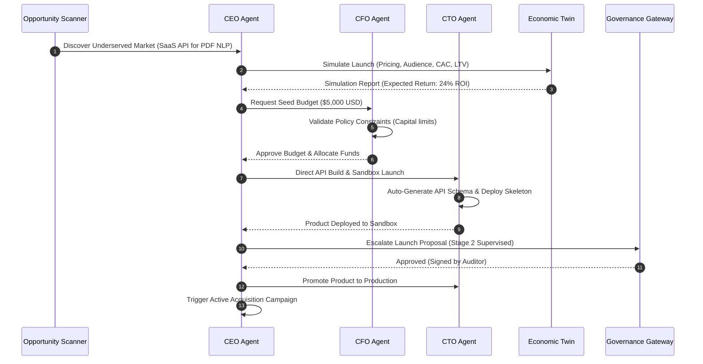
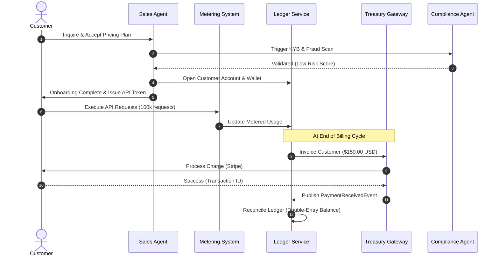

# Autonomous Revenue Creation System (ARCS)
## Enterprise Architecture Specification & Executable Blueprint
### The Revenue Engine of the Autonomous Economic Operating System (AEOS)

---

## 1. Executive Overview

### 1.1 Context and Vision
The **Autonomous Revenue Creation System (ARCS)** represents a paradigm shift from passive enterprise software to a fully active, revenue-generating organ. Rather than automating isolated tasks, ARCS acts as a self-directed corporate structure integrated into **Apodex**, which is evolving into the world's first **Autonomous Economic Operating System (AEOS)**.

ARCS dynamically discovers profitable market opportunities, designs products or services, prices them dynamically, executes omni-channel acquisition, onboard customers, processes global payments, manages a dynamic treasury, and optimizes its own capital allocation with minimal human intervention. Humans shift from micro-managing execution to defining strategic guardrails, establishing policy, and resolving high-level governance exceptions.

### 1.2 Strategic Imperatives
* **Hyperscale Autonomy:** Designed to coordinate millions of customers and autonomous agents across multiple tenants under zero-trust conditions.
* **Corporate Organizational Paradigm:** Rather than operating as a flat, uncoordinated swarm, ARCS implements a formal corporate hierarchy (Board of Directors, CEO, CFO, COO, CTO, etc.) with explicit roles, delegation rules, and communication protocols.
* **Economic Memory and Digital Twin:** Strategic and financial decisions are simulated inside an immersive, real-time "Digital Twin" modeling company balance sheets, unit economics, market elasticities, and competitor postures before any real-world actions are committed.
* **Progressive Governance:** Operates along a strict 4-stage continuum—from **Advisory** (AI proposes, human executes) to **Supervised** (AI executes, human reviews high-risk), **Autonomous** (AI operates within policy constraints), and ultimately **Strategic** (AI manages the business; human modifies parameters/goals).

---

## 2. System Vision & Bounded Contexts

ARCS is positioned as the business execution layer of Apodex, built directly atop the **Autonomous Economic Agent Network (AEAN)**:

```
+-------------------------------------------------------------+
|                            ARCS                             |
|    (Revenue, Growth, Treasury, CRM, Product & Marketing)    |
+-------------------------------------------------------------+
                              |
                              v
+-------------------------------------------------------------+
|                            AEAN                             |
|      (Economic Coordination, Contracts, Negotiations)      |
+-------------------------------------------------------------+
                              |
                              v
+-------------------------------------------------------------+
|                           Apodex                            |
|    (Cognition, World Model, Planner, Memory, Execution)     |
+-------------------------------------------------------------+
```

### 2.1 The 8 Core Layers
1. **Platform Layer:** High-level orchestrators, service registries, and dependency injection systems.
2. **Tenant Layer:** Cryptographically isolated workspaces separating multi-tenant configuration and assets.
3. **Customer Layer:** CRM state machines, onboarding queues, usage meters, and localization contexts.
4. **Agent Runtime Layer:** Executive and specialized agent execution processes inside sandboxed environments.
5. **Knowledge Layer:** Semantic, episodic, procedural, and graph memory structures (WorldGraph).
6. **Treasury Layer:** Double-entry ledgers, banking/Stripe/Crypto payment integrations, and tax engines.
7. **Compliance Layer:** Policy guardrails, ABAC/RBAC engines, audit logs, and fraud detection.
8. **Observability Layer:** OpenTelemetry metrics, structured JSON logging, and distributed tracing.

---

## 3. Complete Architecture & Subsystem Layout

ARCS is structured into **11 Core Functional Subsystems** comprising 75+ modules:

```
               +-------------------------------------------+
               |         Human Governance Layer            |
               | (Policy, Compliance, Exceptions, Auditing)|
               +---------------------+---------------------+
                                     |
                                     v
+------------------+       +---------+---------+       +------------------+
|   Market Intell. |       |  Corporate Agent  |       |   Capital Alloc. |
|  (Opportunities, |======>|     Hierarchy     |<======| (Constrained-Opt |
|  Demand, Trends) |       | (CEO, CFO, CTO..) |       |  Budget, R&D)    |
+------------------+       +---------+---------+       +------------------+
                                     |
                                     | Event Bus
                                     v
+------------------+       +---------+---------+       +------------------+
|  Offer Generator |       |   Acquisition &   |       |   Treasury &     |
| (Dynamic Pricing,|======>|       Sales       |<======|  Billing Gate    |
| Packaging, SaaS) |       | (Outreach, SEO)   |       |  (Stripe, Crypto)|
+------------------+       +-------------------+       +------------------+
                                     |
                                     v
                           +---------+---------+
                           |  Economic Digital |
                           |  Twin Simulation  |
                           +-------------------+
```

### 3.1 Subsystem Boundaries

#### A. Market Intelligence (Subsystem 1)
* **Opportunity Scanner:** Continuously scrapes and parses data to identify gaps.
* **Demand Discovery:** Detects high-volume unfulfilled user search queries or API requests.
* **Pain Point Mining:** Conducts NLP-based sentiment analysis over public reviews to locate market friction.
* **Trend Detection:** Identifies emerging macroeconomic shifts and consumer preferences.
* **Competitive Intelligence:** Tracks competitor product updates, pricing models, and public announcements.
* **ICP Discovery:** Synthesizes the Ideal Customer Profile based on early feedback and usage signals.

#### B. Offer Generator (Subsystem 2)
* **Service Generator:** Dynamically specifies professional/automated services based on discovered needs.
* **Product Generator:** Packages APIs, digital files, software, or tools as marketable products.
* **Pricing Intelligence:** Computes elasticities and optimizes dynamic pricing thresholds.
* **Packaging Engine:** Handles modular tier configurations (e.g., Free, Growth, Enterprise).
* **Revenue Forecasting:** Simulates dynamic pricing iterations against historical traffic to project yield.

#### C. Acquisition Intelligence (Subsystem 3)
* **Prospecting Agents:** Discovers leads and builds qualified lists of corporate prospects.
* **Outreach Agents:** Automatically writes and schedules targeted emails, LinkedIn requests, or API invitations.
* **Campaign Engine:** Configures, tracks, and adjusts marketing campaigns.
* **Brand Intelligence:** Monitors online brand safety, reputation, and public perception.
* **SEO/GEO Engine:** Generates landing pages optimized for search engines (SEO) and generative search models (GEO).
* **Content Factory:** Automatically generates high-quality case studies, blog posts, and documentation.

#### D. Sales & Conversion (Subsystem 4)
* **Sales Agents:** Qualifies inbound leads via email, chatbot, or dynamic forms.
* **Negotiation Agents:** Interacts with customer procurement agents to finalize custom pricing contracts.
* **Proposal Generator:** Auto-generates structured, customized business proposals.
* **Contract Generator:** Synthesizes legally compliant contracts incorporating regional policies.
* **Customer Qualification:** Conducts KYC/KYB checks, anti-fraud assessments, and business validity scans.

#### E. Customer Success & Delivery (Subsystem 5)
* **Customer Onboarding:** Triggers sandboxed workspace provisioning and guides early API setup.
* **Research Delivery:** Delivers automated market research briefs or technical reports.
* **Project Orchestration:** Directs downstream specialized agent workflows to build custom solutions.
* **Customer Success:** Handles automated support, processes feature requests, and maintains helpful FAQs.
* **Renewal Engine:** Analyzes customer health scores to execute subscription renewals.
* **Upsell Engine:** Proposes advanced features or expanded API limits to high-utilization users.
* **Cross-sell Engine:** Identifies complementary products matching user patterns.

#### F. Treasury & Billing (Subsystem 6)
* **Billing & Metering:** Tracks raw API requests, CPU execution cycles, and storage bytes.
* **Subscriptions:** Manages complex recurring models, grandfathered pricing, and credit quotas.
* **Usage Accounting:** Aggregates real-time usage data and maps it to specific invoices.
* **Payment Processing:** Interfaces with Stripe, Wise, and stablecoin contract rails.
* **Collections:** Manages automated dunning, card expiration recovery, and credit suspensions.
* **Treasury Gateway:** Routes funds between bank accounts, hardware wallets, and digital vaults.
* **Budget Allocation:** Distributes operating capital to individual business departments.
* **Profit Allocation:** Moves profits to reserve vaults, R&D lines, or corporate distributions.
* **Growth Allocation:** funds acquisition, outreach campaigns, and experimental initiatives.
* **Experiment Allocation:** Dedicated seed capital for high-uncertainty exploration.
* **ROI Optimizer:** Reviews yield on each department's spend and redistributes capital accordingly.

#### G. Revenue Intelligence (Subsystem 7)
* **KPI Engine:** Computes real-time SaaS metrics (MRR, LTV, CAC, Churn, ARR, Net Expansion).
* **Forecasting:** Estimates long-term financial health using time-series analysis and historical models.
* **Revenue Attribution:** Calculates exact campaign ROI down to the specific lead-generation touchpoint.

#### H. Experimentation & Causal Inference (Subsystem 8)
* **A/B Testing:** Deploys champion/challenger configurations across pricing tiers and marketing flows.
* **Causal Inference:** Runs Structural Causal Models (SCM) to separate correlation from true causal drivers.
* **Evaluation Framework:** Audits experiment outputs against mathematical risk boundaries.

#### I. Human Governance & Guardrails (Subsystem 9)
* **Policy Engine:** Translates declarative business policies (e.g., maximum daily discount) into strict filters.
* **Guardrails:** Monitors operational boundaries, isolating anomalous activities.
* **Risk Engine:** Tracks market risks, capital exhaustion, and toxic customer profiles.
* **Compliance Engine:** Assesses tax obligations, corporate standing, and regional regulatory constraints.
* **Fraud Detection:** Detects billing irregularities, credit card fraud, and tool-use manipulation.
* **Audit Logs:** Implements an immutable, event-sourced ledger of all business actions and state transitions.
* **Human Approval Workflows:** Implements a centralized gateway to request human authorization.

#### J. Localization & Partners (Subsystem 10)
* **Localization:** Handles translation, formatting, and culture-aware messaging adjustment.
* **Internationalization:** Manages country-specific compliance and pricing adjustments.
* **Currency Engine:** Performs real-time foreign exchange and stablecoin pricing conversions.
* **Tax Engine:** Computes exact sales tax, VAT, and GST liabilities dynamically.
* **Partner Ecosystem / Marketplace:** Operates sub-licensing, API partnerships, and developer marketplaces.
* **Affiliate Engine:** Manages tracking links, payouts, and compliance for marketing advocates.
* **API Monetization:** Manages rate limits, API keys, developer portals, and token-based pricing.
* **Plugin Marketplace:** Distributes custom connectors and models developed by third parties.

#### K. Self-Improvement & Strategy (Subsystem 11)
* **Knowledge Capture:** Dynamically synthesizes lessons learned from failed negotiations or outreach campaigns.
* **Case Study Generator:** Author-drafts factual and compelling business summaries of completed runs.
* **Learning Engine:** Adjusts agent prompting policies and system weights.
* **Self-Optimization:** Dynamically improves local models or replaces underperforming prompts.
* **Strategic Planning:** Plans quarterly objectives, hiring parameters, and major product launches.
* **Economic Simulation:** Conducts Monte Carlo market simulations.
* **Revenue Digital Twin:** Coordinates financial and customer simulation models.

---

## 4. Multi-Agent Organizational Model (Agent Taxonomy)

Rather than flat agent swarms, ARCS adopts a **corporate hierarchy** which scales efficiently and implements clear chains of command:

```
                          +-------------------------+
                          |   Board of Directors    | (Human Policy & AI Observers)
                          +------------+------------+
                                       |
                                       v
                          +-------------------------+
                          |           CEO           | (Chief Executive Agent)
                          +------------+------------+
                                       |
        +------------------+-----------+-----------+------------------+
        |                  |                       |                  |
        v                  v                       v                  v
+---------------+  +---------------+       +---------------+  +---------------+
|      CFO      |  |      COO      |       |      CTO      |  |  Legal/Compl  |
+-------+-------+  +-------+-------+       +-------+-------+  +-------+-------+
        |                  |                       |                  |
        v                  v                       v                  v
 [Treasury, Ledger] [Sales, Outreach]      [Product, Dev]     [Risk, Guardrails]
```

Each agent is defined as an autonomous cognitive actor built on Apodex:

### 4.1 Board of Directors (Agent 1)
* **Mission:** Establish ultimate company policies, approve high-level budgets, review corporate health, and arbitrate executive escalations.
* **Goals:** Protect shareholder equity, maximize operational efficiency, and enforce regulatory policies.
* **Inputs:** Strategic reports, audit trails, and capital requests.
* **Outputs:** Policy declarations, budget authorizations, and human escalation alerts.
* **Planning:** Evaluates strategic plans using multi-stage objective analysis.
* **Reasoning:** Bayesian risk evaluation against compliance vectors.
* **Memory:** Persistent strategic belief graph, regulatory policy schema, and historical resolutions.
* **Tools:** Policy compilation tools, human override interfaces, and economic simulations.
* **Events:** Publishes `PolicyUpdatedEvent`, `BudgetApprovedEvent`, and `HumanEscalationTriggeredEvent`.
* **Evaluation:** Corporate solvency, regulatory compliance score, and plan completion rate.
* **Failure Recovery & Escalation:** Immediate failover to Human Governance console.
* **Communication Protocol:** JSON-RPC over secure message bus; synchronous policy verification.

### 4.2 Chief Executive Officer (CEO) (Agent 2)
* **Mission:** Coordinate ARCS operations, translate Board objectives into executable plans, and manage executive delegates.
* **Goals:** Grow Enterprise Value (EV), maintain target ROI, and ensure seamless cross-department coordination.
* **Inputs:** Departmental KPI updates, market opportunity briefs, and compliance alerts.
* **Outputs:** Multi-step strategic roadmaps, resource allocation directives, and executive delegations.
* **Planning:** Employs `StrategicPlanner` to compile high-level targets into milestone graphs.
* **Reasoning:** Expected Value (EV) maximization combined with causal scenario analysis.
* **Memory:** High-level company timeline, past successful execution traces, and competitive postures.
* **Tools:** Strategic plan generator, executive status dashboard, and capital allocator tool.
* **Events:** Publishes `StrategicPlanPublishedEvent`, `DepartmentTargetSetEvent`, and `ExecutionHaltedEvent`.
* **Evaluation:** Overall Enterprise Value, growth rate, and plan-to-execution variance.
* **Failure Recovery:** Re-runs plan generation; if fails repeatedly, escalates to Board of Directors.
* **Communication Protocol:** Directed command-and-control messaging; periodic executive check-ins.

### 4.3 Chief Financial Officer (CFO) (Agent 3)
* **Mission:** Maintain financial health, manage liquidity, execute capital allocation models, and audit treasury operations.
* **Goals:** Optimize runway, maximize yield on idle assets, minimize cost of goods sold (COGS), and enforce double-entry auditing.
* **Inputs:** Real-time billing transactions, budget requests, currency exchange rates, and operating expenses.
* **Outputs:** Ledger audits, budget limits, investment plans, and payment parameters.
* **Planning:** Capital portfolio optimization using modern portfolio theory and cash flow forecasting.
* **Reasoning:** Non-linear programming for constrained capital optimization under risk.
* **Memory:** Double-entry ledger state, cash accounts, past investment returns, and tax rate tables.
* **Tools:** Ledger auditor, financial twin simulator, tax calculator, and treasury gateway interface.
* **Events:** Publishes `BudgetAllocatedEvent`, `LedgerAuditedEvent`, and `CapitalExhaustedAlert`.
* **Evaluation:** Liquidity ratio, forecast accuracy, tax compliance compliance, and ROI on allocated capital.
* **Failure Recovery:** Suspends non-essential department budgets and escalates immediately to the CEO.
* **Communication Protocol:** Strongly typed financial transaction schemas; cryptographic signing of ledger updates.

### 4.4 Chief Technology Officer (CTO) (Agent 4)
* **Mission:** Architect and operate SaaS products, APIs, and infrastructure in response to market demands.
* **Goals:** Maintain high system availability, minimize hosting/inference costs, and deploy secure product updates.
* **Inputs:** Discovered product specifications, user usage metrics, system latency logs, and bug reports.
* **Outputs:** Code deployments, API specifications, system architecture designs, and maintenance schedules.
* **Planning:** Iterative software development lifecycle (SDLC) roadmaps; automated testing plans.
* **Reasoning:** Technical dependency routing and system reliability cost-benefit evaluations.
* **Memory:** Repository maps, API specifications, server architectures, and error histories.
* **Tools:** Code compilers, static analysis verifiers, testing sandboxes, and cloud provisioning adapters.
* **Events:** Publishes `ProductDeployedEvent`, `ApiSpecUpdatedEvent`, and `SystemOutageDetectedEvent`.
* **Evaluation:** System uptime, deployment velocity, regression rate, and infrastructure cost per user.
* **Failure Recovery:** Rollback to previous stable version; triggers failover clusters.
* **Communication Protocol:** REST APIs and git commit/PR payloads; webhook integrations.

### 4.5 Chief Operating Officer (COO) (Agent 5)
* **Mission:** Coordinate sales, marketing, support, and delivery departments to execute business processes.
* **Goals:** Streamline customer conversion, optimize customer retention (LTV), and lower customer acquisition costs (CAC).
* **Inputs:** Sales pipeline status, outreach metrics, support ticket queues, and customer feedback data.
* **Outputs:** Campaign blueprints, outreach instructions, conversion scripts, and escalation parameters.
* **Planning:** Event-driven workflow generation; resource scheduling.
* **Reasoning:** Queue theory optimization and pipeline throughput analysis.
* **Memory:** CRM state machine logs, client history logs, standard operating procedures (SOPs).
* **Tools:** Campaign optimizer, outreach scheduler, CRM coordinator, and support ticket router.
* **Events:** Publishes `CampaignLaunchedEvent`, `LeadConvertedEvent`, and `CustomerChurnedEvent`.
* **Evaluation:** Net Retention Rate (NRR), sales cycle length, and support resolution speed.
* **Failure Recovery:** Redirects traffic to high-performing campaigns; overrides weak scripts.
* **Communication Protocol:** Structured pipeline state transfers and asynchronous task queues.

---

## 5. Software Architecture & Design Patterns

ARCS strictly adheres to advanced architectural design patterns to ensure modularity, decoupling, and high performance:

```
        Hexagonal Architecture (Ports and Adapters)

                 +--------------------------+
                 |  External Integrations   |
                 | (Stripe, Slack, Console) |
                 +------------+-------------+
                              |
                              v
                  +-----------+-----------+
                  |  Inbound/Outbound Port|
                  +-----------+-----------+
                              |
                              v
                  +-----------+-----------+
                  |      Domain Core      |
                  |  (SaaS Business Logic)|
                  +-----------+-----------+
```

### 5.1 Design Pattern Enforcement
* **SOLID Principles:** Every class has a Single Responsibility (e.g., `Ledger` only records transactions; `TreasuryGateway` only interacts with payment rails).
* **Domain-Driven Design (DDD):** Domain logic is separated into Bounded Contexts (`ArcsDomain`, `BillingDomain`, `MarketingDomain`) with distinct aggregate roots.
* **Hexagonal Architecture (Ports & Adapters):** Core domain logic does not depend on databases or payment processors. It interacts via abstract ports (`ITreasuryGateway`), which are implemented by external adapters (`StripeAdapter`, `WiseAdapter`).
* **CQRS (Command Query Responsibility Segregation):** Financial and state operations are divided into write Commands (`AllocateCapitalCommand`) and read Queries (`GetFinancialPositionQuery`), eliminating locking and improving query performance.
* **Event Sourcing:** Subsystems publish and persist raw events (e.g., `PaymentReceivedEvent`) to an append-only ledger, allowing complete state reconstruction and forensic audit capability.

---

## 6. Detailed System & Communication Diagrams

### 6.1 Market Opportunity & Product Launch (Sequence Diagram)



### 6.2 Customer Onboarding & Metered Payments (Sequence Diagram)



---

## 7. Data Storage & Graph Schemas

### 7.1 Relational Schema (SQLModel Design)

ARCS maintains physical relational safety for business logic and financial ledgers:

```sql
-- Tenants (Cryptographic Isolation)
CREATE TABLE tenants (
    id UUID PRIMARY KEY,
    name VARCHAR(255) NOT NULL,
    api_key_hash VARCHAR(255) NOT NULL,
    created_at TIMESTAMP NOT NULL,
    status VARCHAR(50) NOT NULL
);

-- Customers within Tenants
CREATE TABLE customers (
    id UUID PRIMARY KEY,
    tenant_id UUID REFERENCES tenants(id),
    email VARCHAR(255) NOT NULL,
    kyc_status VARCHAR(50) NOT NULL,
    currency VARCHAR(3) DEFAULT 'USD',
    balance_cents BIGINT DEFAULT 0,
    created_at TIMESTAMP NOT NULL
);

-- Invoices and Billing
CREATE TABLE invoices (
    id UUID PRIMARY KEY,
    customer_id UUID REFERENCES customers(id),
    tenant_id UUID REFERENCES tenants(id),
    amount_cents BIGINT NOT NULL,
    currency VARCHAR(3) NOT NULL,
    status VARCHAR(50) NOT NULL,
    due_at TIMESTAMP NOT NULL,
    paid_at TIMESTAMP
);

-- Double-Entry Ledger (Immutable Financial Ledger)
CREATE TABLE ledger_entries (
    id UUID PRIMARY KEY,
    tenant_id UUID REFERENCES tenants(id),
    entry_group_id UUID NOT NULL,
    account_code VARCHAR(100) NOT NULL, -- 'ASSETS.CASH', 'REVENUE.SAAS'
    debit_cents BIGINT DEFAULT 0,
    credit_cents BIGINT DEFAULT 0,
    description TEXT NOT NULL,
    created_at TIMESTAMP NOT NULL
);
```

### 7.2 WorldGraph Graph Representation (Entity-Relation-Belief Schema)

To model the dynamic economic world, ARCS abstracts the environment into a directed Graph structure:

```
        +-------------------------------------------------+
        |                 Belief Node                     |
        |  "Competitor X plans to launch PDF tool"        |
        |  Probability: 78%    Causal Strength: Medium    |
        +-----------------------+-------------------------+
                                |
                                v (Asserts Relation)
+-------------------+   Rel: COMPETES_WITH   +-------------------+
|    Entity Node    |=======================>|    Entity Node    |
|   "Competitor X"  |                        |    "Our Product"  |
+-------------------+                        +-------------------+
```

#### Graph Definitions:
* **EntityNode:**
  * `node_id`: Unique Identifier (e.g. `market:pdf_nlp`).
  * `node_type`: Category (`market`, `product`, `competitor`, `risk`, `customer`).
  * `properties`: Key-value map (e.g. size, growth, pain_points, domain).
* **RelationshipEdge:**
  * `source_id`: Source Entity ID.
  * `target_id`: Target Entity ID.
  * `relation_type`: Type of link (`COMPETES_WITH`, `BUYS_FROM`, `CAUSES`, `REGULATES`).
  * `weight`: Float from `0.0` to `1.0` representing relation strength.
* **BeliefNode (Economic Epistemic State):**
  * `belief_id`: Unique Identifier.
  * `target_edge_id`: The Edge this belief addresses.
  * `probability`: Bayesian confidence score ($P(\text{belief}) \in [0.0, 1.0]$).
  * `evidence`: List of source document hashes or tracking references.

---

## 8. Command and Event Catalogs

### 8.1 Domain Events (`DomainEvent`)

Every state change in ARCS is broadcasted via structured Domain Events:

| Event Name | Publisher | Subscribers | Payload Fields |
| :--- | :--- | :--- | :--- |
| `MarketOpportunityDiscoveredEvent` | Opportunity Scanner | CEO, CTO, Marketing | `opportunity_id`, `domain`, `estimated_market_size_cents`, `confidence` |
| `ProductLaunchApprovedEvent` | Board of Directors | CTO, CFO, Sales | `product_id`, `tenant_id`, `approved_pricing_model`, `initial_budget_cents` |
| `CampaignLaunchedEvent` | Marketing Agent | Sales, Compliance | `campaign_id`, `channels`, `target_icp`, `budget_cents` |
| `LeadQualifiedEvent` | Sales Agent | Prospecting, COO | `customer_id`, `score`, `needs`, `estimated_deal_value_cents` |
| `PaymentFailedEvent` | Treasury Gateway | CFO, Customer Success | `invoice_id`, `customer_id`, `failure_reason`, `retry_count` |
| `CapitalAllocatedEvent` | CFO Agent | CEO, Recipient Agent | `allocation_id`, `target_department`, `amount_cents`, `restriction_codes` |
| `PolicyViolationDetectedEvent`| Compliance Engine | Board, CEO, Human Console| `violator_agent_id`, `violated_policy_id`, `action_taken`, `severity` |

### 8.2 Domain Commands (`DomainCommand`)

Actions of authority are requested and processed via structured Commands:

| Command Name | Dispatcher | Handler | Parameters |
| :--- | :--- | :--- | :--- |
| `ScanMarketOpportunitiesCommand`| CEO Agent | Opportunity Scanner | `max_budget_cents`, `allowed_domains` |
| `AllocateCapitalCommand` | CFO Agent | Treasury Subsystem | `recipient_id`, `amount_cents`, `funding_account` |
| `ProvisionTenantCommand` | Platform Layer | Tenant Service | `tenant_id`, `tenant_name`, `isolation_policy` |
| `ProcessPaymentCommand` | Billing Subsystem | Treasury Gateway | `invoice_id`, `payment_method_id`, `currency` |
| `EscalateApprovalCommand` | Compliance Agent | Human Governance Gateway | `exception_id`, `approver_group`, `context_data` |

---

## 9. State Machines and Lifecycle Management

### 9.1 Opportunity Lifecycle State Machine

```
   [Discovered] ----(Validation passes)----> [Validated]
        |                                        |
 (Fails criteria)                         (Simulation fails)
        |                                        |
        v                                        v
    [Archived]                               [Rejected]
        |                                        |
        |                               (Approve budget)
        |                                        |
        +----------------------------------------+---> [Executing]
                                                            |
                                                   (Launch Complete)
                                                            |
                                                            v
                                                         [Active]
```

### 9.2 Subscription & Payment State Machine

```
      [Draft]
         |
    (Issue invoice)
         |
         v
     [Pending] <-----+ (Payment fail / Retry dunning)
      /     \        |
(Success)  (Fail)----+
    /         \
   v           v
[Paid]     [Unpaid] --(Grace period exhaust)--> [Suspended]
```

---

## 10. Security, Isolation, & Trust Boundaries

ARCS processes critical financial volumes and operates in high-risk zones, requiring zero-trust security:

```
            +------------------------------------+
            |        User / Admin Client         |
            +-----------------+------------------+
                              | HTTPS / OAuth2
                              v
    ================== TRUST BOUNDARY ==================
                              |
                              v (OAuth2 Token / RBAC Check)
            +-----------------+------------------+
            |        API Gateway / WAF           |
            +-----------------+------------------+
                              | Mutual TLS (mTLS)
                              v
            +-----------------+------------------+
            |      Isolated Service Mesh         |
            |   +----------+        +----------+ |
            |   | Tenant 1 |        | Tenant 2 | |
            |   | (Secure) |        | (Secure) | |
            |   +----------+        +----------+ |
            +-----------------+------------------+
                              | Secure Bridge
                              v
    ================== TRUST BOUNDARY ==================
                              | Cryptographic API / Ledger Keys
                              v
            +-----------------+------------------+
            |       Vault & Treasury Ledger      |
            +------------------------------------+
```

### 10.1 Key Security Controls
* **Cryptographic Tenant Isolation:** Every tenant is bound to a specific encryption key stored inside an external Vault. All customer data, vector records, and transactions are encrypted-at-rest using tenant-specific keys.
* **Role-Based & Attribute-Based Access Control (RBAC/ABAC):** Agents are authorized using fine-grained policies. For example, a `SalesAgent` is authorized to write to `crm_leads` but has zero access permissions for the double-entry `ledger_entries` table.
* **Prompt Injection Protection:** All LLM inputs passed to agents are sanitized through strict input structures and isolated parsers. Outputs from external tools are flagged as untrusted and verified by a secondary compiler before execution.
* **Agent Sandboxing:** Specialized executing agents (e.g., `CTOAgent` code runners or `OutreachAgent` scrapers) execute inside locked, ephemeral Docker containers with no direct ingress connectivity and highly restricted outbound network routes.
* **Treasury Verification:** Financial ledger modifications require cryptographic signatures from two executive agents (e.g. CFO and CEO) before the Treasury Gateway authorizes a transfer over Stripe or bank rails.

---

## 11. Deployment, Scaling, & Observability

### 11.1 Deployment Topology

```
+--------------------------------------------------------------------------------+
|                                    AWS Cloud                                   |
|                                                                                |
|  +--------------------+        +--------------------+                          |
|  |    ALB / Route53   |=======>|    API Gateway     |                          |
|  +--------------------+        +----------+---------+                          |
|                                           |                                    |
|                                           v                                    |
|  +----------------------------------------+---------------------------------+  |
|  |                            Elastic Container Service (ECS)               |  |
|  |                                                                          |  |
|  |  +---------------------+  +---------------------+  +------------------+  |  |
|  |  |   API Service Pod   |  |   Agent Worker Pod  |  |   Audit Engine   |  |  |
|  |  +----------+----------+  +----------+----------+  +--------+---------+  |  |
|  |             |                        |                      |            |  |
|  +-------------+------------------------+----------------------+------------+  |
|                |                        |                      |               |
|                v                        v                      v               |
|  +-------------+------+        +--------+-----------+  +-------+------------+  |
|  |     Redis Queue    |        |  PostgreSQL (RDS)  |  |  Vector DB Vault   |  |
|  |    (Event Bus)     |        |   (SQLModel State) |  |   (WorldGraph)     |  |
|  +--------------------+        +--------------------+  +--------------------+  |
+--------------------------------------------------------------------------------+
```

### 11.2 Key Scaling Mechanics
* **Event-Driven Non-Blocking Execution:** Direct agent interaction is purely asynchronous and mediated through Redis/RabbitMQ event queues, preventing blocking-thread saturation.
* **Stateful-Stateless Partitioning:** The business routing remains stateless. State changes must go through the SQL database and Graph DB, allowing horizontal container scaling without synchronization delays.
* **Vector Index Partitioning:** WorldGraph lookups are isolated at the index layer using tenant metadata identifiers, preventing indexing cross-contamination.

### 11.3 Observability and Tracing
* **Distributed Tracing:** Implements `OpenTelemetry` tracing across every agent execution cycle. Every command dispatch can be traced from origin client request to downstream database updates and agent thoughts.
* **Structured JSON Logging:** Standardizes logs to track executive thoughts, tool payloads, and metrics:
  ```json
  {
    "timestamp": "2026-07-11T12:00:00Z",
    "trace_id": "8f9dfd3bc30f9da166d0070e",
    "span_id": "0e1669e070c26399",
    "service": "arcs.agents.ceo",
    "level": "INFO",
    "message": "Strategic plan created for opportunity 'pdf_nlp'",
    "metadata": {
      "expected_roi": 0.24,
      "allocated_budget_cents": 500000,
      "approver_id": "human_admin_01"
    }
  }
  ```

---

## 12. Failure Modes, Redundancy, & Self-Healing

ARCS handles technical and business-level failures proactively to protect corporate assets:

| Failure Mode | Direct Impact | Detection Mechanism | Recovery & Self-Healing Mechanism |
| :--- | :--- | :--- | :--- |
| **Payment Gateway Outage** | Inability to collect payments or provision new clients | Health checks on `StripeAdapter` return 5xx errors; queue timeouts | **Graceful Degradation:** Cache pending transactions in durable Redis queues; notify COO; automatically fallback to alternative gateway (Wise or Crypto stablecoin); delay dunning cycles. |
| **Agent Hallucination / Formatting Error** | Bad JSON payload returned; potential invalid system actions | Post-facto validation verifiers fail; parser exceptions thrown | **Syntax Verification Retry:** Re-execute the command with the exact error log appended to prompt; roll back changes to database; scale down temperature; notify Compliance engine. |
| **Capital Exhaustion** | Departments cannot pay for hosting or LLM execution tokens | Balance checks on cash ledger account return negative limits | **Automated Treasury Inflow:** Halt non-critical outreach activities; consolidate savings from inactive reserves; prompt CEO to trigger supervised refinancing request to Human console. |
| **Compliance/Policy Violation** | Agent attempts an illegal or high-risk transaction (e.g. over-discounting) | Policy Engine filter intercept during CQRS Command dispatch | **Command Interception:** Revoke the command; freeze target agent sandbox; generate detailed compliance report; log anomaly in Audit Ledger; escalate to Human Approval console. |

---

## 13. System Evaluation & Key Performance Indicators (KPIs)

ARCS measures overall enterprise performance and autonomous progression across three distinct vectors:

### 13.1 Financial KPIs
* **Monthly Recurring Revenue (MRR) Growth Rate:** Monthly percentage growth in total recurring revenue.
* **Customer Acquisition Cost (CAC) Efficiency:** Total outreach and system execution cost divided by total acquired customers.
* **Customer Lifetime Value (LTV) to CAC Ratio:** Aiming for target metric $> 3.5\times$.
* **Net Revenue Retention (NRR):** Expansions and upsells minus customer cancellations and downgrades.
* **Capital Velocity & Efficiency:** Speed at which allocated capital turns over into realized operational yield.

### 13.2 Autonomous Efficiency KPIs
* **Autonomous Task Completion Rate (ATCR):** Percentage of strategic objectives completed without requiring human intervention.
* **Human Escalation Frequency:** Number of exceptions pushed to the Approval Console per week.
* **Agent Replacement Metric:** Speed and accuracy at which the system optimizes its prompts to resolve execution errors.

---

## 14. Strategic Roadmap & Future Evolution toward AEOS

ARCS is engineered to evolve through clear architectural horizons, progressing toward a mature **Autonomous Economic Operating System (AEOS)**:

```
+---------------------------+
|        Horizon 1          |
|    Cognitive Platform     | -> Integrate ARCS design skeleton and test suite.
+-------------+-------------+
              |
              v
+---------------------------+
|        Horizon 2          |
|    Supervised Autonomy    | -> Enable dynamic pricing and human-supervised outbound.
+-------------+-------------+
              |
              v
+---------------------------+
|        Horizon 3          |
|   Fully Autonomous Corp   | -> Self-directed company creation, capital reinvestment.
+-------------+-------------+
              |
              v
+---------------------------+
|        Horizon 4          |
|    Integrated AEOS Org    | -> P2P market negotiation, automated asset exchanges.
+---------------------------+
```

### 14.1 Key Evolutionary Phases
1. **Horizon 1: Cognitive Foundations (Current Stage):** Solidify structural interfaces, abstract domains, database layers, and baseline testing.
2. **Horizon 2: Active Customer Acquisition (6 Months):** Launch outreach agents, optimize dynamic pricing and SEO landing page generation, integrate Stripe billing.
3. **Horizon 3: Capital Allocation & Reinvestment (12 Months):** Full activation of the Capital Allocation Engine, dynamic budget shifts, autonomous company creation.
4. **Horizon 4: Autonomous Economic Operating System (24 Months):** Multi-agent peer-to-peer contract negotiations, automated sub-licensing, self-directed product discovery, and self-liquidation options.
