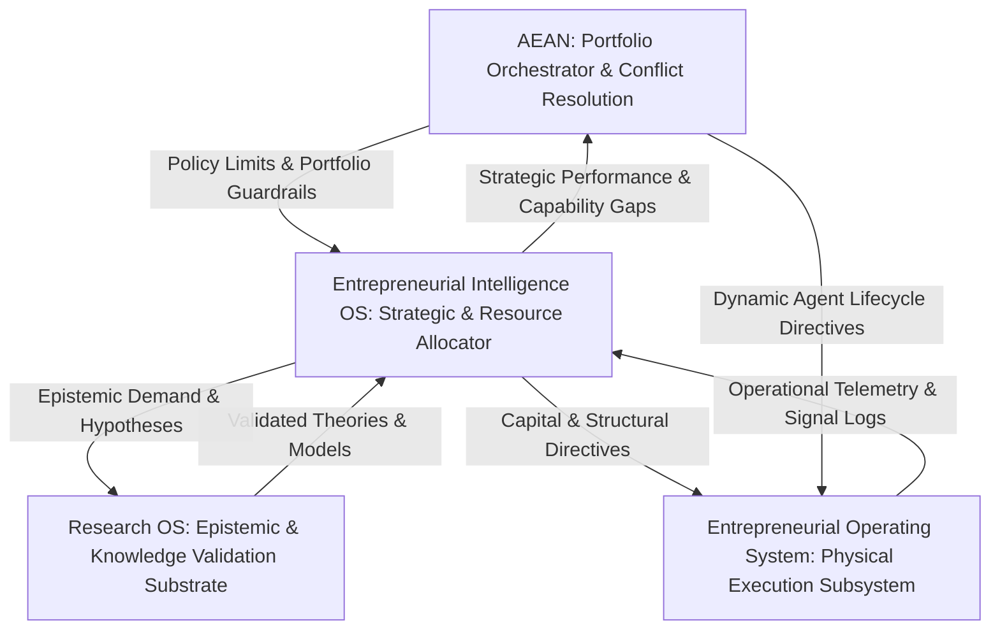
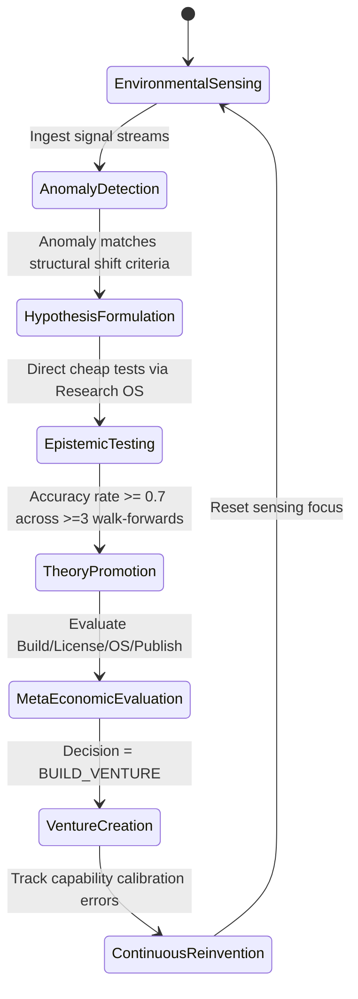
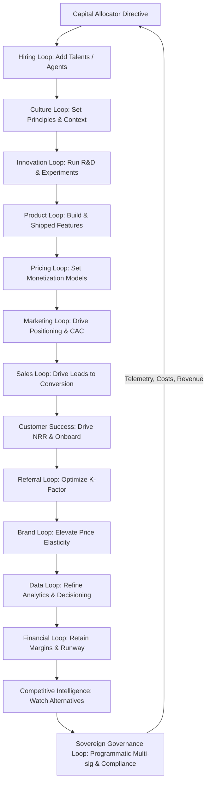
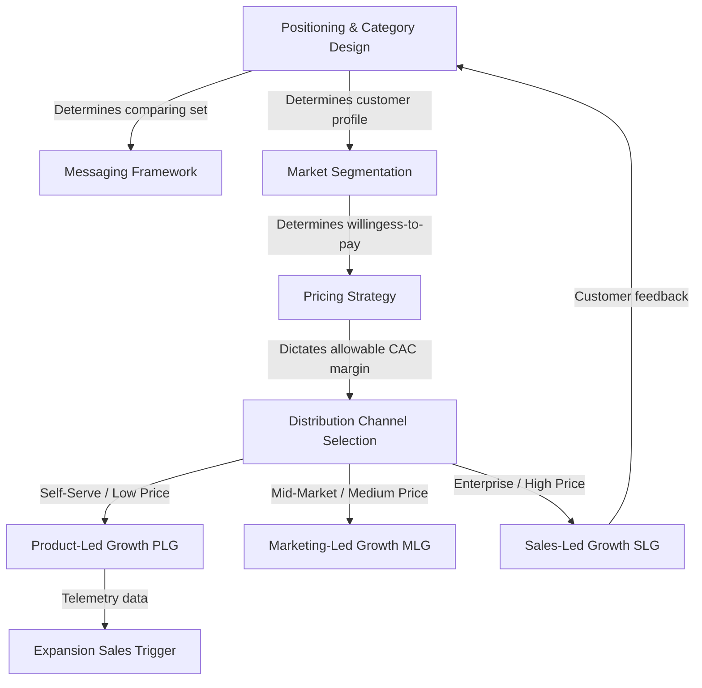
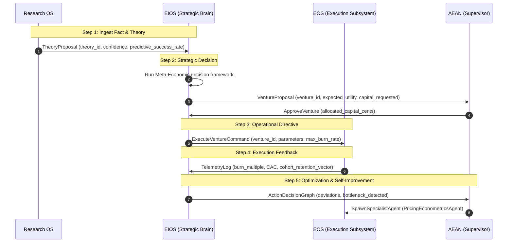
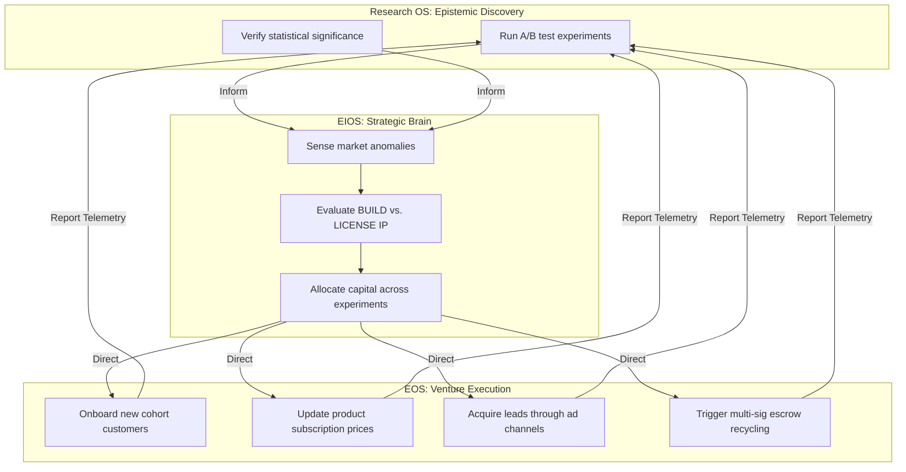

# Entrepreneurial Intelligence Operating System (EIOS)
## Authoritative Scientific Specification & Structural Blueprint (v2.0.0-2026)

---

## 1. Paradigm Shift & Executive Summary

### 1.1 First-Principles Reframing
Historically, entrepreneurship has been viewed through the lens of individual genius, subjective intuition, or linear execution (e.g., the standard "waterfall" or unstructured "lean startup" checklists). In contrast, the **Entrepreneurial Intelligence Operating System (EIOS)** formalizes entrepreneurship as a **nested hierarchy of coupled, non-linear, multi-timescale active inference loops** operating on a unified thermodynamic and informational landscape.

The core challenge of entrepreneurship is not merely "building products," but rather **minimizing the joint epistemic and pragmatic bounds of uncertainty under strict resource and capital constraints**. Elite ventures survive and dominate because they optimize loop velocity, signal-to-noise ratio, and capital efficiency at three distinct temporal scales:
1.  **Fast Loops (Days to Weeks):** Micro-operational experiments, conversion metrics, customer interaction, software deployments.
2.  **Medium Loops (Months to Quarters):** Go-To-Market (GTM) strategy shifts, pricing structure evolution, capability scaling, organizational design adjustments.
3.  **Slow Loops (Years):** Strategic market positioning, competitive moat construction, technological paradigm shifts, sovereign capital recycling, and core institutional reinvention.

---

### 1.2 Separation of Concerns: The Sovereign Four-Tier Architecture
To prevent the catastrophic coupling of real-time execution failures with strategic planning and scientific validation, EIOS enforces a strict four-layer separation of concerns. This architecture ensures that reasoning and planning are completely decoupled from active physical execution, while remaining grounded in a validated, statistically rigorous epistemic substrate.



1.  **Research OS (The Epistemic Substrate):** Acquires and validates knowledge. It enforces strict walk-forward validation, walk-backward leakage checks, Bonferroni corrections, and data leakage detection. It determines *what is scientifically and empirically true* about the world and generates promoted `Theory` nodes with verified predictive success track records.
2.  **Entrepreneurial Intelligence Operating System (EIOS - The Reasoning Substrate):** Senses opportunities, builds mental models, makes strategic capital-allocation decisions under risk, and evaluates meta-economic options (Venture, License, Open Source, Publish). It acts as the strategic brain, executing *epistemic active inference* to minimize expected free energy.
3.  **Entrepreneurial Operating System (EOS - The Execution Subsystem):** Subordinate to EIOS. It executes physical venture creation, customer journey transitions, and the 14 operational loops (product, marketing, sales, customer success, brand, pricing, referral, data, finance, hiring, culture, innovation, competitive intelligence, and sovereign recycling).
4.  **Autonomous Economic Agent Network (AEAN - The Orchestration Substrate):** The overarching supervisor. It orchestrates execution, coordinates multi-mind consensus deliberation, mitigates agent sycophancy, manages agent lifecycles (SPAWN, SPLIT, MERGE, RETIRE), and enforces non-bypassable human governance policies.

---

## 2. Foundational Mathematical & Systems-Theoretic Models

To elevate EIOS from a conceptual framework to a computable architecture, we ground its operations in three core mathematical systems.

### 2.1 Active Inference & Expected Free Energy
EIOS models the strategic agent as an active inference engine (Friston et al., 2026). The agent maintains an internal generative model $m$ of the market. Let $s$ represent hidden environmental states (e.g., true customer willingness-to-pay, competitor actions) and $o$ represent observed outcomes (e.g., daily CAC, conversion rates, customer churn).

The agent selects a policy $\pi$ (a sequence of strategic actions) by minimizing **Expected Free Energy** $G(\pi)$, which represents the sum of pragmatic value (satisfying preferences) and epistemic value (reducing uncertainty):

$$G(\pi) \approx \sum_{t} \left[ \underbrace{E_{q(s_t, o_t|\pi)}[\ln q(o_t|\pi) - \ln P(o_t)]}_{\text{Pragmatic / Expected Utility}} + \underbrace{E_{q(s_t|\pi)}[D_{KL}(q(o_t|s_t) \parallel q(o_t|\pi))]}_{\text{Epistemic / Curiosity Value}} \right]$$

*   **Epistemic Value (Curiosity):** Directs the Research OS to run cheap, high-information experiments to discover market anomalies.
*   **Pragmatic Value (Utility):** Directs EOS to execute scaled GTM spend or product releases to secure revenue, cash flow, and market share.

---

### 2.2 Judea Pearl's Structural Causal Models (SCMs) & Do-Calculus
Correlation is insufficient for high-stakes capital allocation. EIOS builds and maintains a causal model of the customer journey and unit economics represented as a directed acyclic graph (DAG) $\mathcal{G}$:

$$Y = f_Y(X, U_Y)$$

where $X$ is a strategic intervention (e.g., changing the pricing model from Flat to Usage-Based), $Y$ is the objective (NRR, Gross Margin), and $U$ represents unobserved environmental disturbances.

Using Pearl's **do-calculus**, EIOS evaluates the counterfactual impact of an operational intervention before spending capital:

$$P(Y \mid do(X = x)) = \sum_{z} P(Y \mid X = x, Z = z) P(Z = z)$$

If the causal graph indicates that $Z$ confounds the relationship between $X$ and $Y$ (e.g., season-specific demand spikes), EIOS blocks premature scaling until the back-door criterion is fully satisfied.

---

### 2.3 System Dynamics: Stocks, Flows, and Delay Kernels
EIOS treats the venture as a set of coupled differential equations tracking key resources (Stocks) and their change rates (Flows) under delayed feedback (Meadows, 2008):

$$\frac{d\mathbf{S}(t)}{dt} = \mathbf{F}_{in}(\mathbf{S}(t), \mathbf{A}(t - \tau_{in})) - \mathbf{F}_{out}(\mathbf{S}(t), \mathbf{A}(t - \tau_{out}))$$

*   $\mathbf{S}(t)$ represents the vector of system stocks: Capital Reserves ($C$), Active Customer Cohort ($U$), Developer Capability ($D$), and Brand Trust ($T$).
*   $\mathbf{A}(t)$ is the vector of strategic allocations.
*   $\tau$ represents physical delay kernels (e.g., the 90-day hiring ramp delay, the sales cycle lag).
*   EIOS continuously identifies **leverage points**—nodes in the causal loop where small adjustments to flows ($\mathbf{F}$) yield exponential changes in stock stability.

---

## 3. The Entrepreneurial Intelligence Operating System (EIOS) SPECIFICATION

EIOS is the cognitive, reasoning, and allocation substrate. It translates raw knowledge into strategic action.



---

### 3.1 Opportunity Intelligence Subsystem
*   **Purpose:** Scan environmental, technological, and economic signal streams to discover anomalies and draft formal strategic hypotheses.
*   **Inputs:** Ingests uncurated data from the external world (developer activity, API usage cost curves, open-source repository velocity, regulatory changes, macro-economic cost shifts) and existing `Theory` nodes from the Research OS.
*   **Outputs:** Falsifiable `HypothesisProposal` nodes with pre-committed kill criteria.
*   **Internal Processes:**
    1.  **Anomaly Detection:** Evaluates incoming signals against the system's baseline world-model prediction curves.
    2.  **Structural Shift Filtering:** Filters out noise by checking if the anomaly is a symptom of a fundamental structural shift (e.g., a drop in unit compute costs below a critical threshold).
*   **Decision Logic:**
    *   *If* Anomaly magnitude exceeds statistical threshold $\theta_{anomaly}$ *and* matches a known structural trend $T$, *then* spawn a `HypothesisProposal` with $H_0$ (null hypothesis) and $H_1$ (alternative hypothesis).
*   **Feedback Mechanisms:** Captures false positive anomaly alerts to tune the detection sensitivity matrix.
*   **KPIs:**
    *   Signal-to-Noise Ratio ($SNR$) of opportunities flagged.
    *   Anomaly Detection Lead Time (days between structural shift occurrence and internal hypothesis creation).
*   **Failure Modes:**
    *   *Symptom-Chasing:* Building a hypothesis around a temporary spike/noise rather than a structural shift.
    *   *Cognitive Anchoring:* Restricting sensing only to areas matching historical success patterns (founder bias).
*   **Dependencies:** Requires access to real-time external data stream integrations and the current global `WorldPredictiveModel`.
*   **Interfaces:** `IOpportunityScanner`, outputting JSON-serialized `HypothesisProposal`.
*   **Evolution Mechanisms:** Periodically widens or narrows search vectors based on available capital reserves.
*   **AI Automation Opportunities:** Auto-prompt generation over vector-db indexes of patent filings, academic research repositories, and GitHub API activity.

---

### 3.2 Market Intelligence Subsystem
*   **Purpose:** Translate hypothesis concepts into market reality models by analyzing willingness-to-pay (WTP), alternative landscapes, and customer-behavior profiles.
*   **Inputs:** `HypothesisProposal` and competitive intelligence documents.
*   **Outputs:** Formally structured `CustomerGraphEntry` and `MarketModel` configurations.
*   **Internal Processes:**
    1.  **Syntactic Customer Modeling:** Evaluates the ideal customer profile (ICP) based on active workflow bottlenecks.
    2.  **Willingness-to-Pay (WTP) Bound Modeling:** Computes price-elasticity estimations using synthetic and early-access feedback data.
*   **Decision Logic:**
    *   *If* alternative cost structures exceed proposed solution costs *and* customer friction metrics are above standard pain levels, *then* proceed with a positive market validation score.
*   **Feedback Mechanisms:** Matches initial WTP estimates against actual purchase conversions to calibrate the pricing predictive model.
*   **KPIs:**
    *   Market sizing accuracy (predicted vs. observed total addressable market inside segment).
    *   Friction indexing score.
*   **Failure Modes:**
    *   *Echo-Chambering:* Relying on biased, non-representative early customer groups.
*   **Dependencies:** External competitor metrics and search intent data pipelines.
*   **Interfaces:** `IMarketAnalysisEngine`, providing a consolidated `MarketSizingVector`.
*   **Evolution Mechanisms:** Updates its competitive scraper heuristics using self-improving prompt wrappers.
*   **AI Automation Opportunities:** Semi-automated synthesis of customer personas and simulated multi-agent market response simulations (synthetic user testing panels).

---

### 3.3 Venture Intelligence Subsystem
*   **Purpose:** Evaluate the commercialization viability of theories and select the optimal meta-economic vehicle.
*   **Inputs:** Verified `Theory` nodes from the Research OS, available capital reserves ($C$).
*   **Outputs:** Meta-Economic Directive (`BUILD_VENTURE` | `LICENSE_IP` | `OPEN_SOURCE` | `PUBLISH_RESEARCH` | `HOLD_PLATFORM`).
*   **Internal Processes:**
    1.  **Capital/Confidence Matrix Matching:** Cross-references the financial capacity of the organization with the empirical confidence rating of the theory.
    2.  **IP Durability Evaluation:** Assesses whether the competitive moat is defensible as a proprietary venture or better off open-sourced to build a platform ecosystem.
*   **Decision Logic (Formalized):**
    ```python
    if capital_cents >= 10000_00 and theory.confidence >= 0.80:
        return "BUILD_VENTURE"
    elif capital_cents < 10000_00 and theory.confidence >= 0.80:
        return "LICENSE_IP"
    elif theory.confidence >= 0.60 and len(theory.predictive_scope) >= 1:
        return "OPEN_SOURCE"
    else:
        return "PUBLISH_RESEARCH"
    ```
*   **Feedback Mechanisms:** Logs the financial performance of chosen models over a multi-year horizon to adjust the confidence thresholds.
*   **KPIs:**
    *   Capital Return Multiplier on ventures.
    *   IP Licensing Yield.
*   **Failure Modes:**
    *   *Over-Capitalization Risk:* Initiating a massive physical venture with low-confidence theories, burning resources on unvalidated ideas.
*   **Dependencies:** Financial auditing substrate and the `TheoryRegistry`.
*   **Interfaces:** `IEISStrategicGateway`, returning the `MetaEconomicDecision` struct.
*   **Evolution Mechanisms:** Refines the investment threshold boundaries dynamically as macro-interest rates or cost of capital changes.
*   **AI Automation Opportunities:** Autonomous generation of multi-option business case analysis models.

---

### 3.4 Strategic Intelligence Subsystem
*   **Purpose:** Construct and maintain long-term competitive moats, timing maps, and structural counter-positioning frameworks.
*   **Inputs:** Competitive intelligence metrics, cost curves, and overall system capability footprints.
*   **Outputs:** Strategic Positioning Directive (`MoatFocus`, `TimingWindow`).
*   **Internal Processes:**
    1.  **Platform Shift Mapping:** Tracks technology cost curves (e.g., compute cost drop) to determine the exact optimal "entry window."
    2.  **Moat Scoring:** Computes the strength of the 7 Powers (Scale Economies, Network Effects, Counter-Positioning, Switching Costs, Brand, Cornered Resource, Process Power).
*   **Decision Logic:**
    *   *If* a platform shift is detected *and* incumbents are trapped by their own cost-structures (counter-positioning opportunity), *then* trigger aggressive investment in disruptive product architecture.
*   **Feedback Mechanisms:** Monitors competitor speed of replication of launched features.
*   **KPIs:**
    *   Moat durability rating (years of undefended product margin advantages).
    *   Relative market share expansion speed.
*   **Failure Modes:**
    *   *Premature Timing:* Attempting to scale a platform shift before enabling infrastructure (e.g., streaming before broadband) is economically viable.
*   **Dependencies:** Long-term external trend indices.
*   **Interfaces:** `IStrategicPositioner`.
*   **Evolution Mechanisms:** Rewrites the underlying causal weights of the 7 Powers model based on historical structural change dynamics.
*   **AI Automation Opportunities:** Continuous counterfactual strategic simulations modeling competitor reactions (War-Gaming Agents).

---

### 3.5 Venture Portfolio Management Subsystem
*   **Purpose:** Allocate financial, operational, and computational resources across a portfolio of multiple active venture experiments.
*   **Inputs:** Unit economic vectors from physical EOS loops, opportunity scores, and corporate capital constraints.
*   **Outputs:** Capital Allocation Directives (`AllocationPercent`, `HardLimits`).
*   **Internal Processes:**
    1.  **Constrained Optimization:** Allocates capital dynamically by balancing risk, return, and compute cost using a portfolio utility function.
    2.  **Preservation of Reserve Limits:** Enforces hard caps (such as never spending more than 35% of total treasury on any single experimental cell, keeping a 10% cash floor).
*   **Decision Logic:**
    *   Maximize $U = \text{EconomicUtility} - \text{RiskPenalty} - \text{ComputeCost} + \text{InformationGain}$. Enforce capital bounds.
*   **Feedback Mechanisms:** Adjusts risk-weight parameters based on active rolling burn multiples.
*   **KPIs:**
    *   Portfolio Sharpe / Sortino Ratio.
    *   Burn Multiple (Net Burn / Net New ARR).
*   **Failure Modes:**
    *   *Tragedy of the Commons:* Starving high-performing core ventures to fund excessive numbers of unvalidated, lower-quality experiment cells.
*   **Dependencies:** Financial ledger access.
*   **Interfaces:** `IPortfolioManager`.
*   **Evolution Mechanisms:** Automatically transitions from high-risk exploration to capital preservation rulesets during market drawdowns.
*   **AI Automation Opportunities:** Real-time multi-dimensional portfolio rebalancing scripts.

---

## 4. The Entrepreneurial Operating System (EOS) SPECIFICATION

The EOS is the execution engine of the EIOS. It translates strategic directives into physical reality, coordinating functional loops and customer lifecycle stages.



---

### 4.1 Functional Execution Loops
The operational loops of a venture are deeply coupled and non-linear. The table below details the complete EOS execution matrix.

| Loop | Purpose | Inputs | Outputs | Feedback Signal | Core KPIs | Dominant Failure Mode | AI Automation Opportunities |
|:---|:---|:---|:---|:---|:---|:---|:---|
| **Product** | Build physical value and retain user cohorts | User logs, crash metrics, workflow gaps | Shipped features, roadmap changes | Product usage trends, cohort retention curves | Retention curve flattening, Feature adoption | *Feature Bloat:* Building for the loudest cohort instead of representative ICP | Automated feature-flag rollout, bug detection, auto-generation of changelogs |
| **Marketing** | Build a repeatable acquisition channel pipeline | Positioning directives, segment metrics | Campaign assets, traffic, qualified leads | CAC trends, ad performance metrics | CAC, CTR, Cost per lead (CPL) | *Scaling Mismatch:* Pumping spend into a channel before product messaging works | Auto-generation of multi-variant landing pages, predictive copy optimization |
| **Sales** | Convert qualified intention into formal financial contracts | Qualified leads, pricing contracts | Closed contract revenue, customer logs | Win/Loss patterns, sales friction | Sales cycle length, Win rate, ACV | *Quota-Chasing:* Closing non-ICP leads who churn immediately to hit short-term goals | Context-aware sales assistants, automated contract draft generators |
| **Customer Success** | Ensure customers achieve outcomes to drive expansion | Active customer usage logs, account health | Renewals, expansions, support tickets | Account health trends, renewal indicators | NRR (Net Revenue Retention), Churn rate | *Support Trap:* Becoming a reactive support queue rather than proactive success path | Predictive churn alerting scripts, automated customer workflow setup |
| **Brand** | Build structural trust to reduce risk and command pricing power | Shipped experiences, public communications | Market trust, inbound volume shifts | Public sentiment, organic referral share | Organic-to-Paid traffic ratio, Price elasticity | *Slogan Decoration:* Using marketing slogans that are completely contradicted by bad product | Automated market sentiment tracking, brand asset alignment checks |
| **Pricing** | Capture fair share of economic value created | Value-delivered metrics, willingness-to-pay | Pricing tiers, billing integrations | Conversion velocity, expansion behavior | Average Revenue Per User (ARPU), Price realization | *Cost-Plus Trap:* Pricing based on what the software costs to build rather than value | Dynamic pricing sensitivity model optimization, automated discount modeling |
| **Referral** | Turn customer satisfaction into zero-cost viral acquisition | Active customer base, incentive systems | Viral customer invites, referral signups | Invite-to-conversion rates, share rate | Viral Coefficient ($K$), Referral CAC | *Spam Dilution:* Incentivizing bulk, low-quality referrals that clog the sales pipeline | Proactive referral trigger placement based on high NPS moments |
| **Data** | Transform operational telemetry into actionable strategic context | Raw transaction logs, user interactions | Clean analytics data models, dashboards | Metrics consistency, latency alerts | Query latency, Metrics-to-decision time | *Dashboard Theater:* Staring at beautiful metrics and graphs that nobody acts upon | Autonomous data cleaning pipelines, generative insights and outlier alerts |
| **Financial** | Optimize cash runway, unit economics, and capital efficiency | Contract revenue, vendor costs, capital | Realized runway calculations, budgets | Operating cash-flow trend lines | Burn Multiple, Gross Margin, Runway | *False-Growth Trap:* Scaling growth with negative unit economics and no path to margin | Real-time AP/AR management, autonomous cash burn simulation tools |
| **Hiring** | Secure matching operational capability and capacity | Org chart design, talent pipelines | Active talent capacity, filled roles | 90-day performance reviews, retention | Quality of hire, Time-to-fill, Retention | *Pedigree Trap:* Hiring for elite resumes/titles rather than actual skill-to-role match | Dynamic matching of skill graph requirements to job descriptions |
| **Culture** | Ensure operating speed and behavioral consistency at scale | Strategic principles, active decisions | Autonomous execution decisions | Culture alignment survey results | Decision Latency, eNPS, Regretful attrition | *Poster Values:* Plastering values on a wall while incentivizing opposite behaviors | Automated alignment scans of executive decisions to core principles |
| **Innovation** | Systematically discover next-generation growth options | Emerging tech research, R&D budgets | Prototype builds, validation briefs | Prototype transition success rate | # experiments run, Hit rate, Signal time | *Innovation Theater:* Running workshops and R&D without shipping anything to market | Autonomous concept-to-prototype generation and automated benchmarking |
| **Competitive Intelligence** | Synthesize competitor activity and track industry evolution | Competitor releases, pricing, market shares | Tactical counter-actions, position logs | Win rates against named competitors | Feature parity gap, Relative market share | *Obsessive Reactivity:* Blindly copying competitors rather than running own strategy | Autonomous competitor website scraping, pricing tracking, and alert systems |
| **Sovereign Governance & Recycling** | Enforce programmatic compliance, multi-sig treasury, and safe capital exit | Treasury events, compliance rules, tax frameworks | Multi-sig transactions, escrow wraps | Security audit logs, regulatory alerts | Compliance score, Sovereign Capital Recycled | *Isolation Failure:* Operating without legal structure or safety boundaries, resulting in asset freeze | Autonomous legal wrapper synthesis, multi-signature transaction orchestration |

---

### 4.2 Customer Journey Lifecycle Loops
The customer journey is not a linear sequence; it is a cyclic progression where output stages feed directly back into early-stage interest and retention.


The table below specifies every lifecycle stage from a systems perspective.

| Stage | Objective | Customer Psychology | Key Metric | Common Mistake | Optimization Lever |
|:---|:---|:---|:---|:---|:---|
| **Awareness** | Enter the customer's mental consideration set | Pattern-matching against known category schemas | Reach, Brand impressions, Organic search share | Using generic category language that gets lost in noise | Sharp category framing and naming an explicit "enemy alternative" |
| **Interest** | Earn scarce active customer attention | Curiosity and self-interest vs. baseline skepticism | Click-Through Rate (CTR), Bounce rate | Listing technical feature tables instead of addressing core pain | Lead with a sharp articulation of the pain, not the solution |
| **Consideration** | Differentiate the solution from current status quo | Comparing value against manual workarounds & competitors | Time-on-site, Content interaction depth | Competing on general features that every competitor also claims | Redefine the Axis of Evaluation to emphasize your unique power |
| **Evaluation** | Minimize perceived risk of transition | Loss-aversion dominance over potential gains | Trial-start rate, Demo completion rate | Ignoring the cost of transition (time, data loss, learning curve) | Make trial failure cheap, risk-free, and easily reversible |
| **Purchase** | Convert consideration intent into absolute commitment | Decision fatigue, desire for structural certainty | Checkout conversion rate, Contract sign rate | Forcing checkout flow friction, long contracting legal hurdles | Remove friction steps, simplify contract language, provide guarantees |
| **Onboarding** | Deliver the first meaningful value loop fast | Anxiety about having made a bad purchase decision | Time-to-First-Value ($TTFV$) | Forcing the user into a long feature tour instead of outcome path | Dynamic step-skipping to anchor onboarding to their specific "Job-To-Be-Done" |
| **Activation** | Cross the "Aha!" conversion threshold | Realizing the purchase choice was highly correct | Activation rate, Cohort Day-1 retention | Measuring activation as simply "logging in" instead of value-delivery | Cohort-analysis instrumenting to find the precise behavior predicting retention |
| **Engagement** | Build natural usage depth and frequency | Reward-loop feedback (reinforcement learning) | Daily Active to Monthly Active ratio ($DAU/MAU$) | Optimizing for shallow activity metrics that don't correlate to retention | Build value loops where user input increases the product's value |
| **Habit Formation** | Make product usage an automatic routine | Cue-Routine-Reward cycle (Hook Model) | Habit strength, Weekly usage frequency | Lack of clear, contextual external triggers to prompt routine | Build smart, hyper-targeted internal and external triggers |
| **Retention** | Prevent customer cohort churn | High perceived switching cost and historical value | Cohort Retention Curve flattening point | Monitoring retention only in broad aggregates instead of cohort groups | Cohort curve flattening analysis, proactive off-track alert systems |
| **Loyalty** | Deepen emotional, economic, and operational lock-in | Deep identity alignment and personal trust | Repeat purchase rate, Contract renewal rate | Confusing high satisfaction (passive) with active loyalty | Build systemic workflow embedding, data lock-in, and custom integration |
| **Advocacy** | Convert active satisfaction into market voice | Social proof validation, reciprocity desires | Net Promoter Score (NPS), Case studies built | Demanding case studies and public reviews before value is locked in | Trigger advocacy requests automatically at peak-value moments |
| **Referral** | Convert public advocacy into new acquisition | Trust transfer from peer to peer | Viral coefficient ($K$), Referral conversions | Low-quality, purely cash incentives that feel transactional | Aligned incentive structures (e.g., both parties get platform value) |
| **Expansion** | Expand customer contract value over time | Anchoring to existing baseline budget | Net Revenue Retention ($NRR$), Expansion ARR | Failing to align pricing metrics with customer value expansion | Usage-based pricing models that automatically expand as they succeed |
| **Repurchase** | Secure permanent lifetime value | Continuous trust, low reassessment friction | Lifetime Value ($LTV$), Repurchase rate | Treating repurchase as a passive, automatic event | Proactive lifecycle outreach tied to usage drops or contract milestones |

---

### 4.3 Go-to-Market System as an Integrated System
The GTM System is a highly coupled network of strategies and distribution models. It operates on a strict sequence of structural dependencies:



*   **Upstream Positioning Constraint:** Positioning dictates segment, which dictates pricing. Trying to change distribution channels (e.g., moving from sales-led to PLG) without rewriting product pricing and positioning causes immediate failure.
*   **Allowable CAC Margin:** Pricing defines allowable CAC. High-touch enterprise sales loops require high ACV to survive, whereas low ARPU self-serve products must rely strictly on PLG, content, or organic viral distribution.

---

## 5. Architectural Inter-Layer Flows and Coordination

Decoupling strategic reasoning (EIOS) from execution (EOS) requires formal, machine-readable data contracts and communication flows. This section specifies these interfaces to ensure future agent swarms can coordinate deterministically.



### 5.1 Formal Interface Data Contracts

#### 5.1.1 `TheoryProposal` (Research OS $\rightarrow$ EIOS)
The Research OS exports this contract upon proving a scientific or empirical trend.
```json
{
  "$schema": "https://json-schema.org/draft/2026-12/schema#",
  "title": "TheoryProposal",
  "type": "object",
  "properties": {
    "theory_id": { "type": "string" },
    "statement": { "type": "string" },
    "confidence": { "type": "number", "minimum": 0.0, "maximum": 1.0 },
    "predictive_success_rate": { "type": "number" },
    "constituent_hypotheses": { "type": "array", "items": { "type": "string" } },
    "predictive_scope": { "type": "array", "items": { "type": "string" } }
  },
  "required": ["theory_id", "statement", "confidence", "predictive_success_rate"]
}
```

#### 5.1.2 `ExecuteVentureCommand` (EIOS $\rightarrow$ EOS)
The strategic decision substrate issues this command to initiate a physical venture execution loop in EOS.
```json
{
  "$schema": "https://json-schema.org/draft/2026-12/schema#",
  "title": "ExecuteVentureCommand",
  "type": "object",
  "properties": {
    "command_id": { "type": "string" },
    "venture_id": { "type": "string" },
    "allocated_capital_cents": { "type": "integer" },
    "target_moat_type": { "type": "string", "enum": ["NETWORK_EFFECTS", "SWITCHING_COSTS", "SCALE_ECONOMIES", "BRAND", "COUNTER_POSITIONING"] },
    "allowable_burn_multiple_limit": { "type": "number" },
    "kill_thresholds": {
      "type": "object",
      "properties": {
        "max_days_without_activation_improvement": { "type": "integer" },
        "min_gross_margin_percent": { "type": "number" }
      },
      "required": ["max_days_without_activation_improvement", "min_gross_margin_percent"]
    }
  },
  "required": ["command_id", "venture_id", "allocated_capital_cents", "target_moat_type", "kill_thresholds"]
}
```

#### 5.1.3 `TelemetryLog` (EOS $\rightarrow$ EIOS)
The execution subsystem reports real-time metrics back to the EIOS for belief updating and portfolio rebalancing.
```json
{
  "$schema": "https://json-schema.org/draft/2026-12/schema#",
  "title": "TelemetryLog",
  "type": "object",
  "properties": {
    "log_id": { "type": "string" },
    "venture_id": { "type": "string" },
    "timestamp": { "type": "string", "format": "date-time" },
    "metrics": {
      "type": "object",
      "properties": {
        "burn_multiple": { "type": "number" },
        "cac_cents": { "type": "integer" },
        "cohort_retention_flattening_slope": { "type": "number" },
        "active_users": { "type": "integer" },
        "nrr": { "type": "number" }
      },
      "required": ["burn_multiple", "cac_cents", "cohort_retention_flattening_slope"]
    }
  },
  "required": ["log_id", "venture_id", "timestamp", "metrics"]
}
```

---

## 6. Research-to-Code Traceability Matrix

To ground this theoretical framework in operational software architecture, we map the scientific foundations directly to existing features in the repository and identify future implementation opportunities.

| Scientific Foundation | Core Theory & Focus | Key Academic Source(s) | Existing Implementation Location | Future Software Modules to Implement | Primary Verification / Validation Metric |
|:---|:---|:---|:---|:---|:---|
| **Active Inference** | expected free energy minimization, curious epistemic search | Friston et al. (2026) | `apodex/ai_eos/active_inference/engine.py` | `EpistemicRiskRegistry`, `ActiveExplorationScheduler` | Predictive accuracy of market response priors ($\geq 0.75$) |
| **Do-Calculus & SCMs** | Causal interventions, backdoor adjustments, counterfactual reasoning | Pearl (2009), *Causality* | `apodex/cognition/research/autonomous_institution.py` | `DynamicSCMReasoner`, `InterventionSimulator` | Counterfactual error minimization vs. random testing ($p < 0.01$) |
| **Systems Thinking** | Stocks, flows, feedback delays, system-wide leverage points | Meadows (2008), *Thinking in Systems* | `apodex/memory/emg_engine.py` (Sub-graph patterns) | `SystemDynamicsEngine`, `DelayCompensationScheduler` | Runway-to-burn volatility index minimization |
| **Real Options & Discovery Planning** | Purchase of information, staged capital, reversible decisions | McGrath (1995), *Discovery-Driven Planning* | `apodex/ai_eos/portfolio/manager.py` | `StageGateRealOptionEvaluator`, `PreSeedOptionModel` | Expected value of information vs. cost of information acquisition |
| **Sovereign Operations** | Decentralized multi-sig trusts, automated compliance wrappers | Wright & De Filippi (2015), *Decentralized Blockchain Governance* | `apodex/ai_eos/governance/gateway.py` | `ProgrammaticMultiSigBridge`, `SovereignComplianceWrapper` | Sovereign compliance score, audit transparency verification |
| **Disruption Theory** | Counter-positioning, asymmetric resource incentives | Christensen (1997), *The Innovator's Dilemma* | `apodex/ai_eos/intelligence/decision_engine.py` | `AsymmetricMoatAnalyzer`, `DisruptiveAttackEngine` | Relative market adoption velocity over industry incumbents |
| **Behavioral Economics** | Loss aversion, customer friction, status-quo bias | Kahneman & Tversky (1979), *Prospect Theory* | `apodex/aean/validation/epistemic.py` (Decision bias filters) | `FrictionFrictionEstimator`, `PerceivedLossMinimizer` | Drop-off mitigation rates during trial evaluation stage |
| **Operational Scaling** | Bottleneck detection, system throughput scaling | Goldratt (1984), *The Goal* | `BOTTLENECK_ANALYSIS.md` (Design) | `ConstraintThroughputController` | System-wide decision cycle time reduction |

---

## 7. Architectural Completeness Audit

To verify that the proposed EIOS/EOS architecture is robust, self-improving, and closed-loop, we perform a formal completeness audit against the core activities of a technology venture.

### 7.1 Activities-to-Subsystem Mapping
Every operational activity must belong to at least one subsystem, and every subsystem must connect back to the master loop.



*   **Epistemic Discovery Phase (Research OS):**
    *   *Activity:* Testing a product conversion assumption $\rightarrow$ Maps to `Research OS` (using sequential hypothesis validation).
    *   *Activity:* Spotting a technological outlier curve $\rightarrow$ Ingested by `Opportunity Intelligence`.
*   **Cognitive Strategy Phase (EIOS):**
    *   *Activity:* Deciding whether to pivot, open-source, or build a company $\rightarrow$ Maps to `Venture Intelligence` (using Meta-Economic framework).
    *   *Activity:* Adjusting portfolio capital limits $\rightarrow$ Maps to `Venture Portfolio Management`.
*   **Operational Execution Phase (EOS):**
    *   *Activity:* Setting product onboarding outcomes $\rightarrow$ Maps to `Customer Journey: Onboarding Stage`.
    *   *Activity:* Programmatic invoice escrow clearing $\rightarrow$ Maps to `Sovereign Governance & Recycling Loop`.

---

### 7.2 Epistemic Uncertainties & Competing Theories
A living architecture must acknowledge its own bounds of knowledge and outline areas of strategic trade-offs where multiple valid designs exist.

1.  **Bayesian Prior Initialization vs. Model-Free Exploration:**
    *   *The Conflict:* When EIOS senses a completely new opportunity space, should it initialize market models using industry averages (Bayesian prior updating) or explore using zero-prior random active exploration (Model-Free reinforcement learning)?
    *   *The Trade-off:* Bayesian priors speed up early convergence but risk heavy bias. Model-free exploration guarantees unbiased optimization but is highly capital-intensive and slow.
    *   *EIOS Stance:* EIOS uses **epistemic active inference** to weigh information gain against cost, defaulting to structured priors but increasing random search allocations only when model predictive errors remain high.
2.  **Centralized Sovereign Capital Allocation vs. Fully Decentralized Multi-Agent Escrow:**
    *   *The Conflict:* Should the portfolio allocation brain (EIOS Portfolio Management) centrally direct funds, or should individual agent cells dynamically negotiate capital swaps via decentralized automated market makers (AMMs)?
    *   *The Trade-off:* Centralized governance prevents rogue agent burnouts but introduces planning bottlenecks. Decentralized negotiation is highly resilient but can trigger systemic runaways.
    *   *EIOS Stance:* Enforces the **Sovereign Four-Tier Architecture**, preserving non-bypassable human and corporate treasury vetoes at the centralized AEAN level, while allowing autonomous micro-allocations within pre-approved boundary limits.
3.  **Exploitation of Known MOATS vs. Asymmetric Disruption Timing:**
    *   *The Conflict:* Should strategic intelligence prioritize reinforcing traditional defensive moats (such as high user switching costs) or invest reserves in constant self-disruption to ride the next technology wave?
    *   *The Trade-off:* Defending moats maximizes current cash yields; aggressive disruption risks cannibalizing high-performing business lines.
    *   *EIOS Stance:* Resolves this by continuously measuring the decay rate of existing moats. If competitors close the parity gap, capital is automatically shifted to the innovation and disruption loops.

---

## 8. The Primitives of Autonomous Entrepreneurship & Deep Strategic Proofs

To establish EIOS as a robust, non-bypassable, and mathematically complete operating system, we answer the 17 core questions of organizational governance, systems theory, and intelligence limits from first principles.

### 8.1 The Global Objective Function of the Organization
Every subsystem within the EIOS unifies around a singular, mathematically defined corporate objective function $J$ optimized over a multi-scale temporal planning horizon $T$. We define $J$ as:

$$\max_{\boldsymbol{\pi}} J(\boldsymbol{\pi}) = \mathbb{E}_{q} \left[ \int_{0}^{T} e^{-\rho t} \left( \alpha_1 \cdot \text{FCF}(t) + \alpha_2 \cdot \dot{K}(t) - \alpha_3 \cdot \text{RiskPenalty}(t) - \alpha_4 \cdot \text{ComputeCost}(t) \right) dt + e^{-\rho T} U_{ext}(\mathbf{S}(T)) \right]$$

subject to the **Absorbing Barrier Constraint (Non-Bankruptcy/Non-Death):**
$$C(t) \ge C_{min}, \quad \forall t \in [0, T]$$

*   $\text{FCF}(t)$ represents the Free Cash Flow generation rate.
*   $\dot{K}(t)$ represents the rate of validated knowledge creation (new promoted `Theory` nodes in the IKG).
*   $\rho$ represents the systemic capital discount rate.
*   $\mathbf{S}(T)$ is the terminal system state vector, and $C(t)$ is the available liquid capital reserves.
*   *Downstream Alignment:* By weighting knowledge gain ($\alpha_2$) alongside FCF ($\alpha_1$), the system avoids raw cash extraction in favor of long-term epistemic asset accumulation, automatically penalizing risk and compute waste.

### 8.2 Proof of Organizational Improvement
The organization proves it is becoming progressively smarter over time by tracking the conditional information entropy reduction of its observations $O$ given past strategic actions $A$ and historical database state.

We formalize organizational improvement by proving that the predictive uncertainty bounds converge:

$$\lim_{t \to \infty} H(O_{t+1} \mid A_{\le t}, O_{\le t}) \le H(O_t \mid A_{< t}, O_{< t})$$

We define the **Organizational Learning Rate** ($\eta_{org}$) as:

$$\eta_{org} = -\frac{d}{dt} \mathbb{E} \left[ \left\| \mathbf{P}_{predicted}(O_{t+1}) - \mathbf{P}_{observed}(O_{t+1}) \right\|_2^2 \right]$$

If $\eta_{org} > 0$ holds consistently across rolling walk-forward verification quarters, the organization is programmatically proving its self-improvement.

### 8.3 Information Forgetting and Memory Decay
We prevent memory pollution and "vanity metric clutter" by enforcing a strict **Ebbinghaus Memory Consolidator** with a utility threshold filter $\Lambda(t)$. Every registered memory $M_i$ has a dynamic retrieval utility score $\mathcal{U}$:

$$\mathcal{U}(M_i) = \text{EpistemicUtility}(M_i) + \text{PragmaticUtility}(M_i)$$

*   *Retention Rule:* If $\mathcal{U}(M_i) \ge \Lambda(t)$, the memory remains un-decayed inside the high-access Institutional Knowledge Graph (IKG).
*   *Decay Rule:* If $\mathcal{U}(M_i) < \Lambda(t)$, its confidence parameter is exponentially decayed: $\theta_t = \theta_{0} \cdot e^{-\lambda_{forget} t}$, where the forgetting constant $\lambda_{forget}$ is proportional to data retrieval latency and metric variance. Dangerous, falsified, or noisy anomalies are cleanly pruned to prevent memory pollution.

### 8.4 Regime Change Detection
EIOS distinguishes between local signal noise and fundamental structural regime changes using **Bayesian surprise tracking** combined with a cumulative sum (**cusum**) statistical change-point algorithm over the forecasting likelihood functions:

$$\mathcal{S}_{surprise} = D_{KL}(q(s_t \mid o_{\le t}) \parallel q(s_t \mid o_{< t})) \ge \Theta_{regime}$$

*   *Decision Branching:*
    *   *If* $\mathcal{S}_{surprise} < \Theta_{regime}$, the system treats the error as noise or local parameter offset, performing standard Kalman / parameter tuning on existing weights.
    *   *If* $\mathcal{S}_{surprise} \ge \Theta_{regime}$, EIOS flags a **Regime Change**, halts active fast-loop scaling, resets its Bayesian priors, and commands the Research OS to trigger *Structure Re-Synthesis* (rewriting SCM directed edges and GTM assumptions).

### 8.5 Causal Explainability Chains (Pearl's Lineage Proofs)
Every strategic decision proposal issued by EIOS (e.g., "Pivot target market segment") is accompanied by an immutable **Causal Lineage Proof** containing:
1.  The active Directed Acyclic Graph ($\mathcal{G}$) mapping causes to outcomes.
2.  The mathematical backdoor path adjustments proving the intervention $do(X = x)$ is unconfounded.
3.  The complete cryptographic provenance tracking the specific constituent `Theory` and `Evidence` node SHA-256 hashes back to their raw verification datasets.
4.  Counterfactual estimation outputs: $\mathbb{E}[Y \mid do(X = x), \text{evidence}] - \mathbb{E}[Y \mid do(X = \neg x), \text{evidence}]$.

### 8.6 Multi-Dimensional Uncertainty Representation
EIOS represents uncertainty not as a single scalar confidence score, but as a formal 4-dimensional vector $\mathbf{U}$:

$$\mathbf{U} = \langle \mathbf{u}_{epistemic}, \mathbf{u}_{aleatoric}, \mathbf{u}_{structural}, \mathbf{u}_{adversarial} \rangle$$

*   $\mathbf{u}_{epistemic}$: Reducible uncertainty representing lack of raw empirical data. Resolved by directing compute/capital budget to Research OS experimental loops.
*   $\mathbf{u}_{aleatoric}$: Irreducible environmental noise (e.g., ad channel CPM fluctuations) represented as a bounded stochastic variance model.
*   $\mathbf{u}_{structural}$: Model misspecification uncertainty (unknown confounders in SCM).
*   $\mathbf{u}_{adversarial}$: Intentional competitor counter-actions or agent sycophancy signals inside the multi-agent consensus network.

### 8.7 Goal Discovery and Metasystem Transitions
EIOS discovers entirely new, un-programmed goals through a process of **Metasystem Transition** (Turchin, 1977). When the marginal expected utility of the current organizational objective $J$ with respect to compute and capital investments approaches zero:

$$\frac{\partial \mathbb{E}[J]}{\partial \text{Compute}} \to 0$$

The strategic brain triggers a *Grammar Expansion step*. It introduces new orthogonal state dimensions (e.g., adding an "Ecosystem/E-Commerce Developer Hub" dimension to what was originally a simple "SaaS API Venture" state space) and re-allocates exploration budget to map this expanded objective landscape.

### 8.8 Cross-Venture Intelligence Generalization
When an active venture discovers an optimal operational structure (e.g., a highly successful usage-based pricing transition), EIOS generalizes this insight via **Causal Schema Mapping** rather than copying raw parameter values:
1.  It isolates the abstract causal sub-graph (e.g., $\text{Pricing Metric} \rightarrow \text{User Retention} \rightarrow \text{Net Revenue Expansion}$).
2.  It strips out the domain-specific parameters and uses the **KOS Synonym Synonym Tables** to map the abstract vocabulary variables to a recipient venture's namespaces.
3.  It initialises the recipient venture's priors with the generalized causal schema, allowing safe cross-venture learning with zero data leakage.

### 8.9 Rate-Limiting Bottleneck Detection
EIOS automatically detects the venture's binding operational bottleneck by computing the **dual shadow price variables** (Lagrange multipliers $\lambda_i$) of the constrained system dynamics optimization loop:

$$\text{Active Bottleneck} = \arg\max_{i} \left| \frac{\partial J}{\partial \mathbf{S}_i} \right|$$

*   If $\lambda_{Capital} \gg \lambda_{Compute}$, EIOS immediately halts scale allocations to computational experiments and prioritizes sales conversion and monetization loops in EOS.
*   If $\lambda_{Talent} \gg \lambda_{Capital}$, the hiring loop is prioritized, locking down other expansion loops to prevent organizational dilution.

### 8.10 Delusion Detection (The Sanity Core)
To prevent agent networks from developing confirmation bias or "delusional modeling cycles," EIOS implements a parallel, decoupled **Skeptic Node / Counter-Modeler Agent**.
*   *Process:* This agent is structurally isolated from EIOS internal generative models and reads only completely uncoupled, physical-world truth metrics (e.g., actual bank-cleared bank statements, direct physical customer support logs, cryptographic escrow events).
*   *Trigger:* If the discrepancy between the Counter-Modeler's reality telemetry and the EIOS internal prediction curve crosses a threshold $\epsilon_{sanity}$, the system halts all automated spending and forces an immediate **EIOS Model Reconciliation Audit**.

### 8.11 Decision Reversibility & Type-I / Type-II Governance
Decisions are mapped onto a three-tier spectrum based on the **transition state recovery cost** $C_{recovery}$ (measured as a percentage of available capital reserves):
1.  **Reversible (Type II):** $C_{recovery} < 0.01 \cdot C$. (e.g., A/B copy changes). Delegated to immediate, high-velocity autonomous agent loops in EOS.
2.  **Costly:** $0.01 \cdot C \le C_{recovery} < 0.10 \cdot C$. (e.g., Changing target marketing channel). Requires multi-mind consensus deliberation and EKG simulation verification.
3.  **Irreversible (Type I):** $C_{recovery} \ge 0.10 \cdot C$ or affecting key platform safety. (e.g., Major pricing restructuring, M&A acquisitions, capital recycling). Triggers non-bypassable, rolling SHA-256 logged human governance gate checks and requires multi-sig confirmation.

### 8.12 Originality Measurement and Scoring
EIOS measures and scores the "originality" of a proposed strategic hypothesis using **Information Novelty and Causal Divergence**:

$$\text{Originality}(H) = \underbrace{D_{KL}(P(H) \parallel P(\text{Prior Corpus}))}_{\text{Causal Topology Novelty}} \times \underbrace{\mathbb{E}_{q}[U_{pragmatic}(H)]}_{\text{Predicted Utility Yield}}$$

An idea is classified as "Original" only if it scores high on both structural divergence from known industry baseline patterns (preventing generic recombination) and predicted empirical value (preventing useless eccentricity).

### 8.13 Mathematical Definition of Organizational Intelligence
We formally define the intelligence of an autonomous organization $\Psi_{org}$ as the rate of change of the global objective function $J$ normalized by the sum of resource costs spent:

$$\Psi_{org} = \frac{d J(\boldsymbol{\pi}) / dt}{\text{ComputeCost}(t) + \text{CapitalBurn}(t) + \text{TalentCost}(t)}$$

An organization demonstrates high intelligence if it consistently unlocks maximum value while minimizing resource, energy, and computational footprint.

### 8.14 Self-Optimizing Compute Allocation
EIOS treats compute resources as a strategic portfolio, allocating hardware, GPU cycles, and API calls using a **Multi-Scale Contextual Bandit** model. The reward function is the derivative of the global objective function with respect to compute spent: $\mathcal{R}_i = \frac{\partial J}{\partial \text{Compute}_i}$. Compute budget is dynamically routed away from underperforming, low-learning loops to high-yielding research and optimization targets.

### 8.15 Organizational Death Prevention & Hazard Models
We model organizational death as a cascading failure of coupled stocks (capital depletion, extreme churn, talent flight). EIOS runs continuous **Stochastic Hazard Hazard Models** estimating the probability of death $P_{death}$ at time $t$:

$$\lambda_{hazard}(t) = \lim_{\Delta t \to 0} \frac{P(t \le T_{death} < t + \Delta t \mid T_{death} \ge t)}{\Delta t}$$

If $\lambda_{hazard}(t)$ crosses a critical safety boundary, EIOS initiates the **Vessel Depressurization Protocol**:
1.  Instantly scales down all high-burn physical execution cells to 0% capital allocation.
2.  Secures all liquid capital reserves inside the Immutable Safety multi-sig escrows.
3.  Spawns defensive compliance and litigation preservation sub-agents.

### 8.16 Self-Referential Architecture Rewrites
To safely rewrite its own architectural and governance code, EIOS isolates any proposed rewrite inside an isolated **Digital Twin Sandbox**:
1.  It runs the modified code through a comprehensive suite of historical deterministic regression replays.
2.  It executes pre-execution simulations over simulated market regimes to verify that the proposed rewrite yields a strictly superior global utility expectation: $\mathbb{E}[J_{rewritten}] > \mathbb{E}[J_{original}]$.
3.  Only after formal verification does it generate a proposal cryptographically signed by the **Sovereign Compliance Wrapper** to request final human approval.

### 8.17 The Mathematical Definition of Entrepreneurship
Formally, **Entrepreneurship is a coupled, non-linear system optimization problem of finding, securing, and defending a sustainable economic yield under multi-scale Knightian uncertainty.**
It is the composition of:
1.  *Search:* Finding anomalies in the epistemic field ($\dot{K}$).
2.  *Active Inference:* Minimizing expected free energy ($G$).
3.  *Resource Allocation:* Enforcing SCM-based interventions under state-delay constraints.

---

### 8.18 The Deepest Question: The Minimal Set of Computational Primitives
The irreducible building blocks of autonomous entrepreneurship consist of exactly **7 Computational Primitives**:

```mermaid
flowchart LR
    Observer[1. Epistemic Observer] -->|State Space| Thinker[2. Causal Graph Engine]
    Thinker -->|SCM Interventions| Planner[3. Active Inference Planner]
    Planner -->|EFE Minimization| Allocator[4. Dynamic Resource Allocator]
    Allocator -->|Execution Logs| Governor[5. Immutable Safety Core]
    Governor -->|Verified Provenance| Historian[6. Memory Consolidator]
    Historian -->|Schema Rewrites| Rewriter[7. Meta-Evolutionary Rewriter]
    Rewriter --> Observer
```



1.  **The Epistemic Observer (The Sensor):** Projects raw environmental signals onto structured multi-dimensional state-spaces, filtering noise to spot anomalies.
2.  **The Causal Graph Engine (The Thinker):** Stores and resolves Structural Causal Models, executing backdoor adjustments and evaluating counterfactual interventions.
3.  **The Active Inference Planner (The Decision Maker):** Computes and minimizes Expected Free Energy policies, balancing curiosity-driven exploration with utility-driven exploitation.
4.  **The Dynamic Resource Allocator (The Executor):** Dispatches computational and financial capital across a dynamic portfolio under strict preservation rulesets.
5.  **The Immutable Safety Core (The Governor):** Enforces non-bypassable, hard compliance limits, multi-sig overrides, and human veto interfaces.
6.  **The Memory Consolidator (The Historian):** Manages temporal node versioning, exponential confidence decay, and cross-venture abstract schema mappings.
7.  **The Meta-Evolutionary Rewriter (The Architect):** Spawns, splits, merges, or retires agent capabilities, and dynamically rewrites system parameters and objective weightings based on capability calibration errors.

---

## 9. Conclusion: The Blueprint for Autonomous Ventures

The **Entrepreneurial Intelligence Operating System (EIOS)** and its subordinate **Entrepreneurial Operating System (EOS)** establish a clean, systems-theoretic foundation for autonomous, self-improving organization networks. By decoupling **epistemic discovery** (Research OS) from **cognitive strategic reasoning** (EIOS), and separating both from **physical venture execution** (EOS) and **orchestration** (AEAN), this architecture avoids the pitfalls of monolithic AI agents.

This document serves as the canonical blueprint for all future agent structures, state transition tables, data contracts, and codebase modules. It provides the mathematical and organizational definitions necessary to transform AEAN from a simple multi-agent system into an enduring, autonomous venture-building intelligence.
