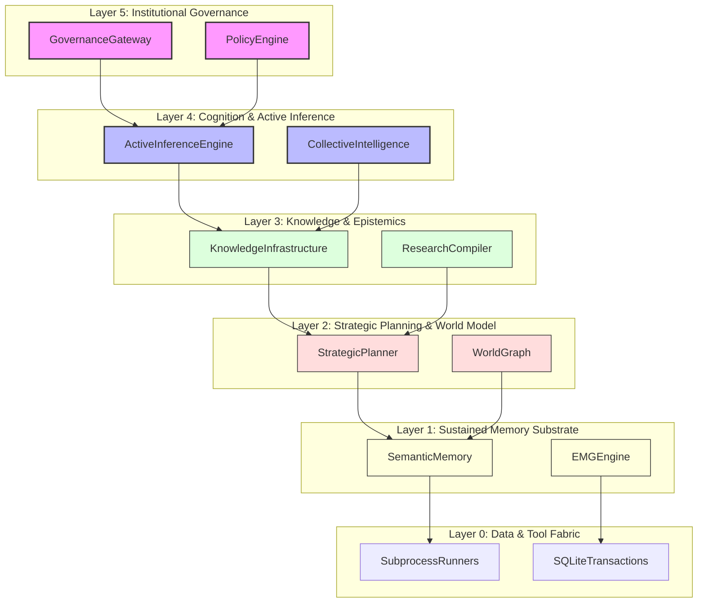

# Cognitive Dependency Graph
## Multi-Layer Substrate Acyclic Coupling Constraints (v3.0.0)

This document formalizes the directional hierarchy and coupling constraints of the Unified Cognitive OS, guaranteeing strict layered access and preventing cyclic dependencies.

---

## 1. Substrate Layers & Maximum Acyclic Depth

The system enforces a strict 6-layer architecture with a maximum acyclic graph depth of 6:

```
┌───────────────────────────────────────────────────────────────────────────┐
│ Layer 5: LIES - INSTITUTIONAL GOVERNANCE                                  │
│         (GovernanceGateway, PolicyEngine, Human HITL, Audit Ledger)       │
├───────────────────────────────────────────────────────────────────────────┤
│ Layer 4: COGNITION & ACTIVE INFERENCE                                     │
│         (ActiveInferenceEngine, CollectiveIntelligence, Multi-Mind)       │
├───────────────────────────────────────────────────────────────────────────┤
│ Layer 3: KNOWLEDGE & EPISTEMICS (KOS)                                     │
│         (KnowledgeInfrastructure, ResearchCompiler, TheoryPromotion)       │
├───────────────────────────────────────────────────────────────────────────┤
│ Layer 2: STRATEGIC PLANNING & WORLD MODEL                                 │
│         (StrategicPlanner, WorldGraph, CausalNode)                        │
├───────────────────────────────────────────────────────────────────────────┤
│ Layer 1: SUSTAINED MEMORY SUBSTRATE                                       │
│         (SemanticMemory, SQLiteMemoryRepository, EMGEngine)               │
├───────────────────────────────────────────────────────────────────────────┤
│ Layer 0: DATA & TOOL FABRIC                                               │
│         (Subprocess Runners, Sandboxed API, File IO, SQL Transactions)    │
└───────────────────────────────────────────────────────────────────────────┘
```

---

## 2. Strict Coupling & Layering Rules

1.  **Strict Downward Calls**: Any component at Layer $N$ may only import or invoke components at Layer $N-1$ or below. Under no circumstances may a lower layer import a higher-layer component.
2.  **No Cyclic Paths**: Circular dependencies across layers are strictly blocked at compile time and verified via runtime exclusiveness checks.
3.  **Encapsulation of Subsystem Access**: No Layer 0 tool execution block may directly access Layer 3 Epistemics or Layer 5 Governance without traversing the intervening layers. All interactions must be routed through the canonical interfaces.
4.  **Acyclic Depth Limit**: The cumulative dependency depth from Layer 5 to Layer 0 must never exceed 6. Any pull request that increases the depth of the graph beyond 6 is automatically rejected by CI.

---

## 3. High-Density Graph Visualization


