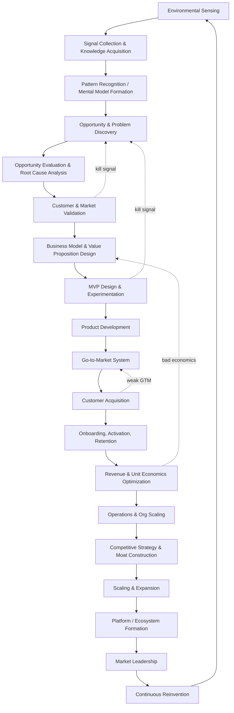
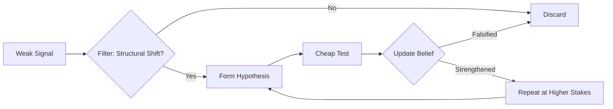
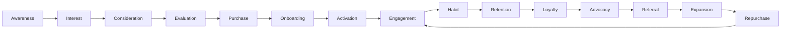
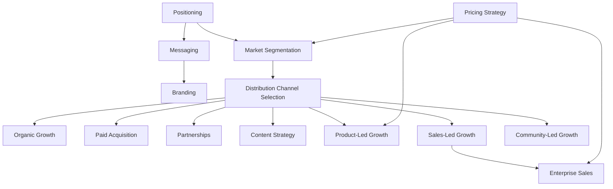
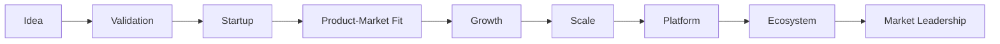
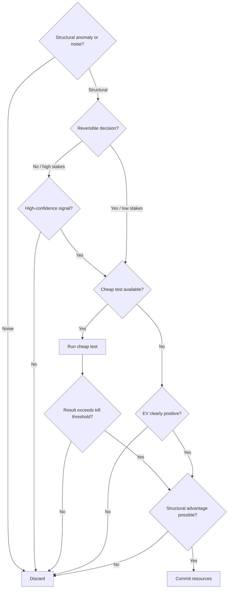

# The Entrepreneurial Operating System (EOS): A First-Principles Reconstruction

## 0. Framing & Assumptions

Entrepreneurship is modeled here not as a linear pipeline but as a **nested set of coupled feedback loops** operating at three timescales:

- **Fast loops** (days–weeks): product experiments, sales calls, ad tests, hiring interviews.
- **Medium loops** (months–quarters): GTM iteration, pricing changes, org design, capital deployment.
- **Slow loops** (years): strategic positioning, moat construction, market category creation, reinvention.

Elite founders (Bezos, Jobs, Musk, Collison, Huang, Hastings, Chesky, Gates) differ from average operators less in *which* stages they execute and more in **loop velocity, signal fidelity, and the discipline to kill loops that aren't compounding.**

**Assumptions stated explicitly:**
1. Access to capital markets, legal infrastructure, and a functioning market economy.
2. "Elite" is operationalized as repeated category creation or category domination across ≥1 venture (not single-hit survivorship).
3. Psychological constructs are drawn from published cognitive and behavioral science.
4. Strategic references represent reported objective organizational behavior.

---

## 1. The Master Loop (Top-Level Architecture)



The master loop is re-entrant at every node. Mature ventures at node R still run internal sensing cycles (nodes A–D) to prevent cognitive ossification. Reinvention (S) operates as a continuous parallel background process.

---

## 2. Internal Cognitive Loops

### 2.1 Signal-to-Idea Pipeline



- **Anomaly Detection**: Focus on structural contradictions in current state models (e.g., exponential traffic curves, CUDA compute mismatches).
- **Forced Hypothesis Generation**: Converted via clear falsifiable claims with pre-committed threshold criteria.
- **Sequential Real Options**: Cheap sequential tests purchase information prior to committing major capital.
- **Risk Categorization**: Differentiation between Type I (irreversible, high-scrutiny) and Type II (reversible, rapid execution) decisions.
- **Opportunity Cost Filter**: Active evaluation against alternative uses of scarce capital and cognitive focus.

### 2.2 Mental Model Evolution

Mental models are treated as living, falsifiable structural graph models:
1. Model generates predictions under environmental conditions.
2. Observed market/product feedback validates or contradicts predictions.
3. System updates parameter weights (fast) or restructures graph topologies (paradigm shift).

---

## 3. External Business Loops

The 13 coupled operational feedback loops:

| Loop | Inputs | Outputs | Feedback Signal | Core KPIs | Failure Mode |
|---|---|---|---|---|---|
| **Product** | User behavior, usage logs | Feature roadmap, builds | Activation/retention deltas | Retention curve slope, NPS | Loudest user bias |
| **Marketing** | Positioning, market data | Awareness, qualified interest | CAC, message resonance | CAC, conversion rate | Message-market mismatch |
| **Sales** | Qualified leads, product | Closed ARR/MRR, win/loss data | Win/loss reasons | Win rate, sales cycle | Selling outside ICP |
| **Customer Success** | Onboarding usage logs | Retention, expansion | Churn reasons, health score | NRR, churn rate | Reactive support trap |
| **Brand** | Product experience, comms | Trust, pricing power | Sentiment, unaided recall | Share of voice, elasticity | Brand as decoration |
| **Pricing** | Value delivered, WTP data | Monetization, market signal | Price conversion, expansion | ARPU, price realization | Cost-plus pricing |
| **Referral** | Satisfaction, incentives | Customer acquisition | Referral rate, K-factor | Viral coefficient (K) | Incentive gaming |
| **Data** | Operational metrics | Actionable decisions | Model vs actual accuracy | Latency, decision cycle | Dashboard vanity |
| **Financial** | Revenue, costs, treasury | Runway, reinvestment | Burn multiple, margin trend | Gross margin, burn multiple | Negative unit economics |
| **Hiring** | Org needs, culture | Talent capacity/capability | 90-day performance | Time-to-fill, quality | Pedigree over role-fit |
| **Culture** | Stated values, incentives | Decision consistency | Sentiment, execution speed | eNPS, decision latency | Values-as-poster |
| **Innovation** | R&D, market signals | Shipped products/features | Time-to-market, hit rate | # experiments, hit rate | Innovation theater |
| **Competitive Intel** | Market & competitor data | Strategic repositioning | Win/loss vs competitors | Relative share trend | Reactive chasing |

---

## 4. Customer Journey Lifecycle (15 Stages)



1. **Awareness**: Enter consideration set via sharp framing.
2. **Interest**: Earn attention by leading with customer pain.
3. **Consideration**: Differentiate against status quo.
4. **Evaluation**: Reduce perceived risk via cheap trials and guarantees.
5. **Purchase**: Convert intent into financial commitment with minimal friction.
6. **Onboarding**: Deliver time-to-first-value anchored to Job-To-Be-Done.
7. **Activation**: Cross the "aha" threshold validated by cohort retention.
8. **Engagement**: Reinforce usage depth tracking predictive retention signals.
9. **Habit Formation**: Embed cue-routine-reward loops.
10. **Retention**: Flatten cohort retention curves.
11. **Loyalty**: Deepen emotional and economic switching costs.
12. **Advocacy**: Prompt user advocacy at peak-value moments.
13. **Referral**: Transfer trust peer-to-peer with aligned incentives.
14. **Expansion**: Expand account value via usage-based expansion triggers.
15. **Repurchase**: Sustain customer LTV through habitual trust.

---

## 5. Go-to-Market System



---

## 6. Company Growth System (9 Stages)



Stages: **Idea**, **Validation**, **Startup**, **Product-Market Fit (PMF)**, **Growth**, **Scale**, **Platform**, **Ecosystem**, **Market Leadership**.

---

## 7. Strategic Thinking & Competitive Moats

- **Cost Curves**: Leverage underlying structural cost curves (compute, energy, bandwidth).
- **Timing Advantage**: Deploy when enabling infrastructure conditions transition to viable.
- **The 7 Powers / Moats**: Network Effects, Switching Costs, Scale Economies, Brand Trust, Counter-Positioning, Cornered Resources, Process Power.
- **Capital Allocation**: Internal real options evaluation balancing pure Research (EDV) and Venture execution (ROI).

---

## 8. Failure Mode Analysis

1. **Solving the Wrong Problem**: Root cause analysis via 5-Whys.
2. **Building Before Validating**: Hard validation gates before engineering resource commitment.
3. **Weak Positioning**: Rebuild positioning around customer status quo alternatives.
4. **Poor Pricing**: Re-anchor prices to quantified customer ROI value.
5. **Distribution Failure**: Test channels matching ideal customer persona behavior.
6. **Lack of PMF**: Stop premature scaling; focus on flattening cohort retention.
7. **Organizational Bottlenecks**: Delegate decision rights via explicit framework rules.
8. **Founder Bias**: Enforce pre-committed kill criteria prior to launch.
9. **Scaling Prematurely**: Audit unit economics at each order-of-magnitude milestone.
10. **Capital Misallocation**: Rank initiatives quarterly on common expected return.

---

## 9. Scientific Foundations

Grounded in:
- **Economics**: Creative destruction, disruption theory, cost curve dynamics.
- **Strategy**: 7 Powers, positioning, counter-positioning.
- **Systems Thinking**: Stocks, flows, coupled feedback loops, leverage points.
- **Decision Theory**: Real options, Expected Free Energy minimization.
- **Behavioral Economics & Cognitive Psychology**: Prospect theory, anomaly detection, Bayesian inference.

---

## 10. Integrated AI-EOS Implementation Architecture

### 10.1 System State Machine

```mermaid
stateDiagram-v2
    [*] --> Sensing
    Sensing --> Hypothesis: anomaly detected
    Hypothesis --> CheapTest: hypothesis formed
    CheapTest --> Discard: falsified
    CheapTest --> Validation: strengthened
    Discard --> Sensing
    Validation --> BuildGate: economic viability confirmed
    Validation --> Discard: no viable economics
    BuildGate --> MVP: resourced
    MVP --> GTMTest: shipped
    GTMTest --> KillOrScale: signal collected
    KillOrScale --> Discard: below threshold
    KillOrScale --> Scale: above threshold
    Scale --> Operate: repeatable loop confirmed
    Operate --> Reinvent: leadership + market maturity
    Reinvent --> Sensing
```

### 10.2 Decision Tree: Opportunity Pursuit



---

## 11. Explicit Limitations

1. Synthesizes empirical venture trajectories into deterministic structures.
2. Non-linear parallel execution simplified into logical feedback stages.
3. Category-defining ventures require concurrent market and product definitions.
4. Assumes market economy access with capital and legal infrastructure.
