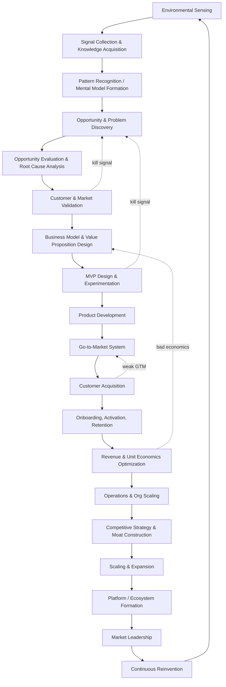
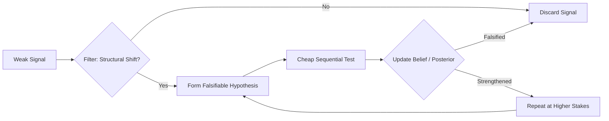
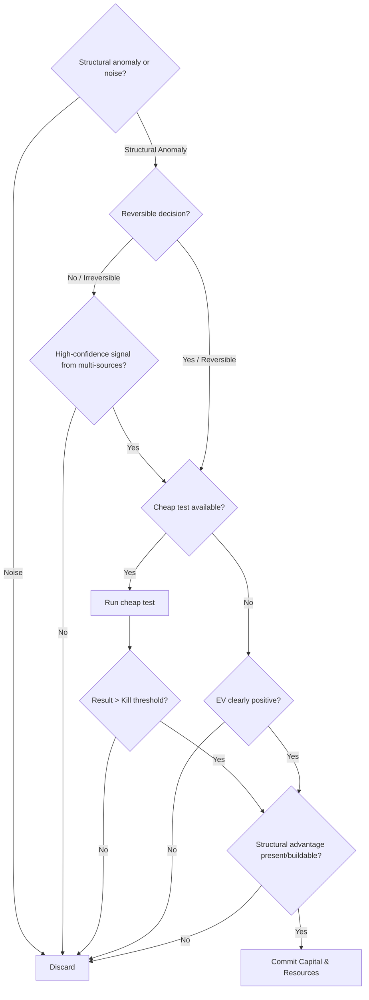

# The Entrepreneurial Operating System (EOS): First-Principles Architecture & Specification

## Executive Summary

The **Entrepreneurial Operating System (EOS)** is a unified, first-principles computational framework that models how elite founders sense, validate, build, scale, and compound enduring institutions. Rather than viewing entrepreneurship as a linear pipeline, EOS models it as a system of **nested coupled feedback loops** operating across three distinct timescales:

1. **Fast Loops** (days–weeks): Rapid execution and empirical probing (e.g., product micro-experiments, sales calls, ad unit tests, engineering sprints).
2. **Medium Loops** (months–quarters): Tactical optimization and organizational evolution (e.g., GTM strategy iteration, pricing realignments, org design, capital deployment).
3. **Slow Loops** (years): Strategic positioning and structural durability (e.g., strategic positioning, moat construction, category creation, structural reinvention).

---

## 0. Framing & Explicit Assumptions

1. **Economic & Institutional Environment**: Assumes access to capital markets, rule-of-law legal infrastructure, and a functioning market economy.
2. **Operationalization of "Elite"**: Defined as repeated category creation or market domination across $\ge 1$ venture, distinguishing deliberate strategy from single-hit survivorship bias.
3. **Cognitive & Behavioral Foundation**: Cognitive constructs are grounded in published decision theory, behavioral economics, and Bayesian inference literature.
4. **Strategic Behavior Baseline**: Public founder cases (Bezos, Jobs, Musk, Collison, Huang, Hastings, Chesky, Gates) are analyzed strictly via observable strategic execution patterns.

---

## 1. Master Loop Architecture (Top-Level Topology)

The Master Loop is a 19-node re-entrant system where mature market leaders continuously run internal sensing and opportunity discovery loops to prevent strategic lock-in and model ossification.



### Re-entrancy & Parallel Reinvention
- Re-entrant at every node: Mature institutions at node **R** execute nodes **A–D** continuously.
- Reinvention (**S**) operates as a permanent parallel subprocess running underneath market leadership.

---

## 2. Internal Cognitive Loops

### 2.1 Signal-to-Idea Pipeline & Decision Heuristics



- **Anomaly Detection**: Over-indexing on structural anomalies—empirical phenomena that contradict the existing mental model but persist under observation (e.g., AWS compute growth, CUDA general compute, DVD rental late-fee dynamics).
- **Forced Hypothesis Generation**: Weak signals are immediately converted into testable hypotheses with explicit pre-committed kill criteria.
- **Uncertainty Reduction via Real Options**: Sequential probing purchases information prior to committing capital, minimizing downside risk while preserving upside volatility.
- **Risk Evaluation Framework**:
  - **Type I Risk (Irreversible / One-Way Doors)**: High scrutiny, slow deliberation, strict governance sign-off.
  - **Type II Risk (Reversible / Two-Way Doors)**: High velocity, decentralized decision rights, cheap experimentation.
- **Opportunity Cost Filter**: Initiatives must satisfy:
  1. Compounding returns over linear additive returns.
  2. Structural advantage defensible against well-resourced incumbents.
  3. Market cap/scale potential within 5–10 years.

### 2.2 Mental Model Evolution

Mental models are treated as living, falsifiable scientific theories:
$$\text{Model Feedback Loop}: \text{Predictions} \longrightarrow \text{Market Probing} \longrightarrow \text{Parameter / Structural Update}$$

- **Parameter Tuning**: Fast-loop numerical adjustments based on daily/weekly operational metrics.
- **Structural Updating**: Rare, high-cost paradigm shifts where foundational assumptions are rewritten (e.g., pivoting business models or target customer segments).
- **Failure Mode**: *Model Ossification*—tuning parameters on a fundamentally flawed structural model.

---

## 3. External Business Loops

The enterprise consists of 13 coupled business loops that continuously exchange inputs, outputs, and feedback signals:

| Loop | Inputs | Outputs | Feedback Signal | Core KPIs | Dominant Failure Mode |
|---|---|---|---|---|---|
| **Product** | Usage data, support tickets, behavior logs | Features, product roadmap | Activation / retention deltas | Retention curve slope, NPS | Building for vocal outliers instead of core ICP |
| **Marketing** | Positioning, market telemetry | Awareness, inbound demand | CAC, traffic intent quality | CAC, brand recall, conversion % | Scaling spend on uncalibrated messaging |
| **Sales** | Qualified leads, product collateral | Revenue, win/loss data | Win/loss friction analysis | Win rate, sales cycle, ACV | Closing non-ICP leads to hit short-term quota |
| **Customer Success** | Onboarding telemetry, usage logs | Retention, account expansion | Churn root causes, health scores | NRR, net churn rate, TTV | Reactive support mistargeted as proactive CS |
| **Brand** | Product experience, public comms | Institutional trust, pricing power | Sentiment, unaided recall | Share of voice, price elasticity | Treating brand as visual decoration vs strategy |
| **Pricing** | WTP data, value metrics | Revenue, positioning signal | Conversion by price point | ARPU, price realization | Cost-plus pricing ignoring economic value |
| **Referral** | Customer satisfaction, incentives | Organic growth flow | Referral conversion rate | Viral coefficient ($K$), referral CAC | Prioritizing referral volume over referee quality |
| **Data** | Operational telemetry across loops | Decisions, automated rules | Model prediction error | Data latency, decision cycle time | Dashboard proliferation without decision links |
| **Financial** | Revenue, costs, capital reserves | Runway, reinvestment budget | Burn multiple, margin trend | Gross margin %, burn multiple | Negative unit economics scaled prematurely |
| **Hiring** | Capacity needs, core values | Talent density, capacity | 90-day performance, attrition | Time-to-fill, hire quality | Hiring for prestige/pedigree over role fit |
| **Culture** | Values-in-action, incentive structures | Behavior consistency | Sentiment, decision speed | eNPS, decision latency | Stated values decoupled from actual incentives |
| **Innovation** | R&D, market shifts, ideas | New product lines / bets | Time-to-market, hit rate | # experiments run, hit rate | Innovation theater without shipped bets |
| **Competitive Intel** | Competitor telemetry, pricing | Strategic repositioning | Win/loss vs named rivals | Share trend, feature parity | Reactive copycatting vs strategy execution |

---

## 4. Customer Journey Lifecycle (15 Stages)


| Stage | Objective | Customer Psychology | Key Metric | Common Mistake | Optimization Lever |
|---|---|---|---|---|---|
| **Awareness** | Enter consideration set | Pattern-matching against known solutions | Reach, unaided recall | Generic category messaging | Sharp category framing / naming new space |
| **Interest** | Earn active attention | Curiosity vs skepticism | CTR, engagement rate | Feature dumping | Lead with customer pain, not product features |
| **Consideration** | Establish superiority | Comparing alternatives & status quo | Depth of engagement | Competing on ubiquitous features | Reframe evaluation criteria |
| **Evaluation** | De-risk decision | Loss aversion dominates gain seeking | Trial starts, demo requests | Ignoring downside risk | Reversible trials, guarantees |
| **Purchase** | Convert intent | Decision fatigue, need for certainty | Conversion rate % | Checkout/contract friction | Remove friction, simplify contracting |
| **Onboarding** | Deliver fast first value | Anxiety regarding wasted effort | Time-to-first-value (TTFV) | Generic product tours | Outcome-anchored onboarding workflows |
| **Activation** | Cross "aha" threshold | Initial habit loop formation | Activation rate % | Defining activation as login | Cohort-anchored value realization |
| **Engagement** | Deepen usage frequency | Reinforcement learning / reward loops | DAU/MAU, session depth | Optimizing vanity activity | Drive habits predicting long-term retention |
| **Habit Formation** | Automatic usage | Cue-routine-reward loop | Habit strength index | Lack of trigger cadence | External + internal triggers |
| **Retention** | Prevent customer churn | Perceived switching costs, value accrued | Retention curve slope | Aggregate retention tracking | Cohort retention curve flattening analysis |
| **Loyalty** | Lock-in alignment | Identity alignment with product/brand | Net promoter / repeat rate | Assuming satisfaction = loyalty | Deep workflow integration & data lock-in |
| **Advocacy** | Turn satisfaction to voice | Social proof seeking, reciprocity | NPS, UGC volume | Requesting reviews prematurely | Prompt at peak value moments |
| **Referral** | Turn advocacy to acquisition | Peer trust transfer | Viral coefficient ($K$) | Financial-only referral incentives | Value-aligned viral loops |
| **Expansion** | Grow account value | Anchoring to existing success | Net Revenue Retention (NRR) | Overselling unneeded seats | Usage-based pricing triggers |
| **Repurchase** | Sustain LTV | Habitual trust, low re-evaluation | Repurchase rate %, LTV | Passive renewal handling | Usage-driven proactive renewals |

---

## 5. Go-to-Market (GTM) System Dynamics

- **Positioning is Upstream**: Positioning dictates comparison set, buyer profile, and channel suitability (e.g., enterprise positioning requires sales-led motion; self-serve positioning dictates PLG/content).
- **Pricing as Strategy Signal**: Price level filters buyer intent and determines economic margin for distribution channels.
- **Channel-Buyer Alignment**:
  - Low Complexity / Low ACV $\longrightarrow$ PLG / Content / Product Virality.
  - High Complexity / High ACV $\longrightarrow$ Enterprise Sales / Field Operations.
  - Network-Effect Products $\longrightarrow$ Community-Led Growth.
- **Compounding Motion**: Land via PLG $\longrightarrow$ Expand via Enterprise Sales $\longrightarrow$ Defend via Ecosystem Network Effects.

---

## 6. Company Growth System (9-Stage Progression Matrix)

| Stage | Objective | Org Design | Decision Rules | Capital Allocation | Primary Risk | Core Metric | Binding Constraint |
|---|---|---|---|---|---|---|---|
| **Idea** | Falsify/strengthen hypothesis | Founder(s) | Intuition & speed | Sweat equity | Solving non-problem | # validated learnings | Founder attention |
| **Validation** | Prove willingness-to-pay | 1–3 hires | Founder-centric | Seed / Pre-seed | False positive validation | Paying customers / LOIs | Signal quality |
| **Startup** | Build repeatable engine | Functional roles | Context-driven team | Seed / Series A | Premature scaling | CAC:LTV early signal | Cash runway |
| **PMF** | Flatten retention curve | First managers | Data > intuition | Growth capital | Traction mistaken for PMF | Retention curve flattening | Bandwidth |
| **Growth** | Scale proven engine | Middle management | Process + metric driven | Series B/C expansion | Funnel decay at scale | YoY Growth, Payback | Hiring velocity |
| **Scale** | Institutionalize execution | Functional departments | Delegated frameworks | Efficient capital | Bureaucracy creep | Rule of 40, NRR | Coordination cost |
| **Platform** | Enable 3rd party builders | Platform teams | Governance & APIs | Infrastructure R&D | Demand-free platform | Developer API usage | Ecosystem trust |
| **Ecosystem** | Orchestrate multi-sided network | Ecosystem BD | Distributed rights | Strategic / M&A | Channel conflict | Ecosystem GMV / density | Credibility |
| **Leadership** | Defend & extend category | Corporate structure | Strategic governance | Defensive + Offensive | Complacency | Category share, Moat | Innovation velocity |

---

## 7. Strategic Thinking & Structural Moats

- **Cost Curve Tracking**: Exploiting exponential cost declines in underlying technologies (compute, storage, bandwidth, sequencing) to time product launch precisely when unit economics cross viability thresholds.
- **Timing Advantage**: Entering the market exactly when enabling technical or economic infrastructure matures, avoiding premature entry before market readiness.
- **Hamilton Helmer 7 Powers & Moat Taxonomy**:
  1. *Network Effects*: Value scales non-linearly with user density.
  2. *Switching Costs*: High procedural, data, or financial costs to replace product.
  3. *Cornered Resource*: Preferential access to scarce data, talent, or IP.
  4. *Counter-Positioning*: Superior business model incumbents cannot copy without cannibalizing existing profits.
  5. *Scale Economies*: Fixed cost amortization yielding lower unit costs.
  6. *Process Power*: Institutionalized operational efficiency.
  7. *Brand*: Unrivaled trust lowering customer decision risk.
- **Internal VC Capital Allocation**: Treating internal capital deployment as an option portfolio, allocating capital based on Expected Free Energy (EFE) and return-on-invested-capital (ROIC).

---

## 8. Failure Mode Analysis & Automated Corrections

| Failure Mode | Root Cause | Detection Signal | Automated Correction Mechanism |
|---|---|---|---|
| **Solving Wrong Problem** | Skipped root-cause analysis | Low engagement despite high survey ratings | Re-execute 5-Whys & Jobs-To-Be-Done audit |
| **Building Without Validation** | Conviction substituted for evidence | High dev velocity, zero demand traction | Impose mandatory pre-build validation gate |
| **Weak Positioning** | No clear alternative comparison | High CAC, long cycles, feature objections | Re-anchor positioning against status quo |
| **Poor Pricing** | Cost-plus pricing strategy | High trial conversion, negative unit margin | Shift to value-quantified pricing tiers |
| **Distribution Failure** | Product-first, channel-blind design | High NPS, flat user acquisition curve | Systematic channel-ICP fit experiment sweep |
| **Lack of PMF** | Premature funnel scaling | Retention curve fails to flatten | Freeze growth spend; return to cohort retention |
| **Org Bottlenecks** | Single-point founder decision rights | Latency spikes on routine approvals | Delegate decision rights with framework boundaries |
| **Founder Bias** | Sunk cost fallacy & confirmation bias | Disconfirming telemetry ignored | Enforce pre-committed kill criteria |
| **Premature Scaling** | Spurious demand spike mistaken for PMF | CAC rising faster than LTV at higher spend | Re-evaluate unit economics per order-of-magnitude |
| **Capital Misallocation** | Lack of opportunity-cost discipline | Concurrent underperforming bets funded | Rank initiatives quarterly by expected EV/EFE |

---

## 9. Scientific Foundations

1. **Economics**: Opportunity cost, cost curves, creative destruction (Schumpeter), disruption mechanics (Christensen).
2. **Strategy**: Hamilton Helmer's 7 Powers, Porter's Competitive Strategy, Positioning (Ries & Trout).
3. **Systems Thinking**: Stocks and flows, feedback delays, leverage points (Meadows).
4. **Decision Theory**: Expected Free Energy, real options (McGrath), Type I/II decisions (Bezos).
5. **Game Theory**: Strategic signaling, focal points, commitment mechanisms (Schelling).
6. **Behavioral Economics**: Loss aversion, prospect theory, cognitive bias (Kahneman & Tversky).
7. **Cognitive Psychology**: Anomaly detection, paradigm shifts (Kuhn), Bayesian belief updating.
8. **Organizational Theory**: Decision rights allocation, structure following strategy (Chandler).
9. **Marketing Science**: Category design, brand equity (Aaker), positioning.
10. **Innovation Research**: Disruption theory, platform shifts.
11. **Operations Research**: Theory of Constraints (Goldratt), throughput optimization.
12. **Complexity Science**: Complex adaptive systems (Holland), non-linear emergence (Beinhocker).

---

## 10. AI-Driven EOS Operating Engine Implementation

### 10.1 System State Machine

```mermaid
stateDiagram-v2
    [*] --> Sensing
    Sensing --> Hypothesis: anomaly detected
    Hypothesis --> CheapTest: hypothesis formed
    CheapTest --> Discard: falsified
    CheapTest --> Validation: strengthened
    Discard --> Sensing
    Validation --> BuildGate: economic viability confirmed
    Validation --> Discard: no viable economics
    BuildGate --> MVP: resourced
    MVP --> GTMTest: shipped
    GTMTest --> KillOrScale: signal collected
    KillOrScale --> Discard: below threshold
    KillOrScale --> Scale: above threshold
    Scale --> Operate: repeatable loop confirmed
    Operate --> Reinvent: leadership + market maturity
    Reinvent --> Sensing
```

### 10.2 Decision Tree: "Should We Pursue This Opportunity?"



### 10.3 AI System Architecture (10 Core Modules/Agents)

1. **Sensing Agent**: Ingests market/tech signals and flags structural anomalies against baseline world model.
2. **Hypothesis Engine**: Formulates falsifiable claims with pre-committed kill criteria.
3. **Validation Agent**: Executes cheap experiments (demand tests, landing page conversion, synthetic customer probes) to measure economic viability.
4. **GTM Simulator**: Simulates channel-pricing-positioning alignment before committing capital.
5. **Growth-Stage Classifier**: Scores venture progress against the 9 growth stages to flag premature scaling.
6. **Moat Analyzer**: Tracks competitor telemetry and quantifies durability across the 7 Powers.
7. **Failure-Mode Monitor**: Pattern-matches operational telemetry against failure modes to issue early warnings.
8. **Capital Allocator**: Ranks active initiatives on common expected-value basis and enforces opportunity-cost discipline.
9. **Reinventor**: Runs continuous sensing internally to trigger self-disruption reviews.
10. **Governance / Safety Layer**: Enforces kill criteria, risk caps, and human-in-the-loop approvals for Type I decisions.

---

## 11. Explicit Limitations

1. **Synthesized Abstraction**: Synthesizes empirical strategic patterns; does not claim access to private internal founder deliberations.
2. **Non-Linear Execution**: Real-world execution involves concurrent oscillations across stages rather than purely sequential transitions.
3. **Category Creation Dynamics**: Category-defining ventures define market boundaries concurrently with product building, requiring rapid fast-loop iteration.
4. **Domain Scope**: Optimized primarily for technology-enabled, venture-backed enterprises in market economies.
