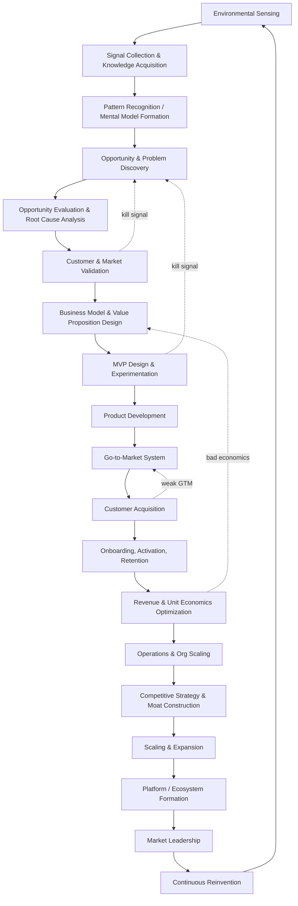
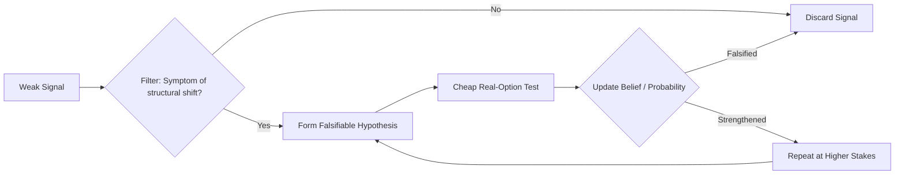
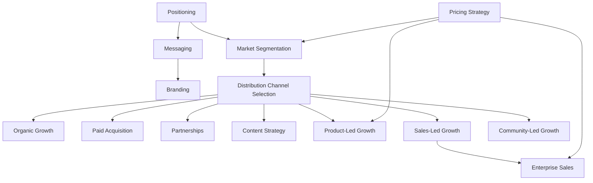
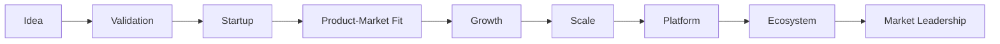
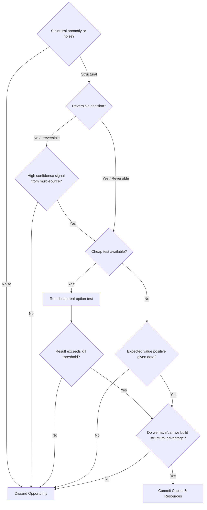

# The Entrepreneurial Operating System (EOS): First-Principles Architectural Specification

---

## 0. Framing & Foundational Assumptions

Entrepreneurship is modeled not as a linear pipeline or static checklist, but as a **nested hierarchy of coupled, non-linear feedback loops** operating continuously at three distinct timescales:

1. **Fast Loops (Days – Weeks)**: Micro-operational experiments, sales calls, ad creative/copy iterations, candidate interviews, feature deployments.
2. **Medium Loops (Months – Quarters)**: Go-to-Market (GTM) motion iteration, pricing structure evolution, organizational design scaling, capital allocation across divisions.
3. **Slow Loops (Years)**: Strategic positioning, moat construction, technological paradigm shifts, market category creation, institutional reinvention.

### Elite Performance Axioms
Elite operators (e.g., Bezos, Jobs, Musk, Collison, Huang, Hastings, Chesky, Gates) differ from average operators primarily through:
- **Loop Velocity**: Unmatched execution speed across fast, medium, and slow feedback cycles.
- **Signal Fidelity**: High-accuracy signal extraction from noisy customer, market, and operational data.
- **Kill Discipline**: Strict willingness to terminate non-compounding loops before committing excess capital.

### Foundational Constraints & Hypotheses
1. **Market Access**: Operates within private-sector, market-economy legal and financial infrastructure.
2. **Operationalization of "Elite"**: Defined as repeated category creation or market domination across $\ge 1$ venture, excluding single-hit survivorship bias.
3. **Scientific Grounding**: Behavioral constructs rely on peer-reviewed cognitive, decision-theoretic, and economic literature.
4. **Data Sources**: Public case observations reflect documented strategic actions rather than quote-based interpretations.

---

## 1. Master Loop Architecture



### System Dynamics Properties
- **Re-entrant Topology**: Even mature category leaders at Node R run Nodes A–D continuously ("operational paranoia").
- **Parallel Reinvention**: Node S (Continuous Reinvention) is a permanent parallel thread executing underneath market leadership.
- **Feedback Reset Gates**: Failure at validation (F), MVP testing (H), acquisition (K), or unit economics (M) triggers immediate upstream re-entry without sunk-cost bias.

---

## 2. Internal Cognitive Loops



### 2.1 Anomaly Detection & Signal Ingestion
- **Anomaly Over-Indexing**: Elite founders focus on structural anomalies—phenomena that contradict prevailing market mental models but are empirically true (e.g., internet traffic growth curves, GPU compute elasticity, bandwidth cost drops).
- **Forced Hypothesis Generation**: Weak signals are converted into explicitly falsifiable claims ("If condition X holds, metric Y shifts by Z%") rather than subjective hunches.

### 2.2 Risk Evaluation & Capital Commitment
- **Type I Risk (Irreversible / "One-Way Doors")**: Actions with high path dependency, irreversible capital commitment, or safety/regulatory lock-in. Evaluated via slow, high-scrutiny deliberation and multi-agent consensus.
- **Type II Risk (Reversible / "Two-Way Doors")**: Rapidly undoable product or operational decisions. Executed with high velocity and cheap experimental probes.
- **Real Options Theory**: Staged experimentation purchases information before committing capital reserves ($C$), minimizing expected free energy ($G$).

### 2.3 Opportunity Cost & Filter Matrix
Every accepted initiative must satisfy three strict criteria:
1. **Compounding Yield**: Generates exponential leverage rather than additive linear output.
2. **Defensible Advantage**: Possesses a structural reason to win that well-resourced incumbents cannot easily replicate.
3. **Scale Capacity**: Operates within a market size capable of yielding massive enterprise value over a 5–10 year horizon.

### 2.4 Mental Model Evolution
Mental models are falsifiable software artifacts. Prediction errors force either parameter tuning (fast, routine) or structural paradigm shifts (rare, high-value re-architecting of causal assumptions).

---

## 3. External Business Loops

The enterprise consists of 13 tightly coupled operational loops:

| Operational Loop | Primary Inputs | Primary Outputs | Feedback Signal | Core KPIs | Dominant Failure Mode |
|---|---|---|---|---|---|
| **Product** | User telemetry, support tickets, usage logs | Feature increments, roadmap pivots | Retention / activation deltas | Retention curve slope, NPS, feature adoption | Building for vocal outliers rather than representative ICP |
| **Marketing** | Positioning, market data, persona profiles | Brand awareness, demand generation | CAC, conversion quality, message resonance | CAC, brand recall, conversion rate | Scaling ad spend prior to messaging-market fit |
| **Sales** | Qualified leads, demo pipeline, product assets | Closed revenue, sales feedback | Win/loss analysis, deal friction | Win rate, sales cycle length, ACV | Selling to non-ICP leads to hit short-term quota |
| **Customer Success** | Onboarding logs, usage metrics, account health | Retention, account expansion | Churn reasons, health score trends | NRR, churn rate, TTFV (time-to-first-value) | Reactive support queue instead of proactive outcome delivery |
| **Brand** | Product experience, public communications | Market trust, pricing power | Sentiment trends, unaided recall | Share of voice, price elasticity | Treating brand as superficial decoration rather than core strategy |
| **Pricing** | Value delivered, WTP data, competitive landscape | Realized revenue, positioning signal | Conversion velocity by price tier | ARPU, price realization, expansion velocity | Cost-plus pricing instead of value-based monetization |
| **Referral** | Customer satisfaction, referral mechanics | Organic customer inflow | Referral rate, viral invite velocity | Viral coefficient ($K$), referral CAC | Incentivizing referral volume over ICP quality |
| **Data** | Operational telemetry, transaction logs | Strategic decision context | Model accuracy vs observed outcomes | Data latency, decision cycle time | Vanity dashboard metrics without actionable decision triggers |
| **Financial** | Revenue streams, cost structures, capital reserves | Extended runway, reinvestment capacity | Burn multiple, margin trends | Gross margin, burn multiple, runway | Premature scaling with negative unit economics |
| **Hiring** | Capability requirements, culture guidelines | Organizational talent capacity | 90-day performance, regretted attrition | Time-to-fill, quality of hire, retention | Hiring for prestige/pedigree rather than role capability match |
| **Culture** | Values-in-action, incentive structures | Consistent autonomous decisions | Employee sentiment, decision speed | eNPS, decision latency | Poster values (stated principles contradicted by incentives) |
| **Innovation** | R&D investments, market signals, internal ideas | New product lines, platform expansions | Market adoption speed, cannibalization rate | # experiments run, hit rate, signal time | Innovation theater (activity without shipped market bets) |
| **Competitive Intelligence** | Competitor activity, pricing, market share shifts | Tactical repositioning, feature alignment | Win/loss vs named competitors | Relative market share, feature parity gap | Obsessive competitor reactivity instead of executing own strategy |

---

## 4. Full-Lifecycle Customer Journey


### Lifecycle Stage Specifications

| Stage | Founder / System Objective | Customer Psychology | Key Metric | Common Failure Mode | Optimization Lever |
|---|---|---|---|---|---|
| **Awareness** | Enter consideration set | Pattern-matching against known category schemas | Reach, unaided recall | Generic messaging lost in noise | Sharp category framing / enemy positioning |
| **Interest** | Earn active attention | Curiosity vs skepticism | CTR, engagement rate | Feature dumping | Lead with pain, not product features |
| **Consideration** | Differentiate from status quo | Comparing value against alternatives | Time on site, content depth | Competing on generic features | Redefine comparison axis around unique strength |
| **Evaluation** | Minimize perceived risk | Loss aversion dominance | Trial starts, demo completion | Ignoring transition risk | Make trial failure cheap & reversible |
| **Purchase** | Convert intent to commitment | Decision fatigue, desire for certainty | Conversion rate, sign rate | Checkout / contracting friction | Eliminate unnecessary contracting steps |
| **Onboarding** | Deliver first value fast | Anxiety regarding purchase choice | Time-to-first-value ($TTFV$) | Long feature tours | Anchor to specific job-to-be-done |
| **Activation** | Cross "Aha!" threshold | Initial habit formation | Activation rate, Day-1 retention | Defining activation as login | Instrument exact behavior predicting retention |
| **Engagement** | Deepen usage frequency | Reinforcement learning / reward loop | DAU/MAU, session depth | Optimizing for shallow activity | Build loops where usage adds user value |
| **Habit Formation** | Make usage automatic | Cue-routine-reward loop | Habit frequency | Lack of external trigger triggers | Contextual triggers and notifications |
| **Retention** | Prevent customer churn | Perceived switching costs | Retention curve flattening point | Aggregate measuring vs cohort curves | Cohort retention curve flattening analysis |
| **Loyalty** | Deepen economic lock-in | Identity alignment | Repeat purchase / renewal rate | Assuming satisfaction equals loyalty | Workflow embedding, data lock-in, community |
| **Advocacy** | Convert satisfaction to voice | Social proof seeking | NPS, case study volume | Asking for reviews prematurely | Trigger requests at peak-value moments |
| **Referral** | Convert advocacy to acquisition | Peer-to-peer trust transfer | Viral coefficient ($K$) | Generic cash referral incentives | Value-aligned double-sided referral rewards |
| **Expansion** | Grow account value | Anchoring to existing spend | Net Revenue Retention ($NRR$) | Underselling adjacent value | Usage-based pricing & seat expansion triggers |
| **Repurchase** | Secure permanent LTV | Low re-evaluation friction | LTV, repurchase rate | Treating repurchase as passive | Proactive lifecycle marketing tied to usage |

---

## 5. Go-to-Market (GTM) System Architecture



### System Principles
- **Positioning Flow**: Positioning is upstream of messaging, channel selection, and sales motion.
- **Pricing Alignment**: Pricing dictates allowable CAC margins (low ARPU forces PLG/organic; high ACV enables Sales-Led motion).
- **Motion Compounding**: PLG usage feeds Enterprise SLG expansion ("Land via PLG, Expand via SLG").

---

## 6. Company Growth Stages



| Stage | Primary Objective | Org Structure | Decision Engine | Capital Allocation | Key Risk | Core Metric | Binding Constraint |
|---|---|---|---|---|---|---|---|
| **Idea** | Falsify or strengthen hypothesis | Founder(s) only | Intuition + fast loops | Sweat equity | Solving non-problem | # validated learnings | Founder attention |
| **Validation** | Prove willingness-to-pay | 1–3 early hires | Founder-centric | Seed / Pre-seed | False-positive bias | Paying customers / LOIs | Signal quality |
| **Startup** | Build repeatable channel | Functional roles | Founder + team context | Seed / Series A | Premature scaling | LTV:CAC early ratio | Cash runway |
| **PMF** | Flatten retention curve | First management layer | Data overrides intuition | Growth capital | Traction vs true PMF | Retention curve slope | Team bandwidth |
| **Growth** | Scale proven channels | Middle management | Process + metrics driven | Series B/C | Scaling broken funnel | ARR growth rate, payback | Hiring velocity |
| **Scale** | Institutionalize repeatability | Specialized departments | Framework-driven | Efficient growth capital | Bureaucracy, culture dilution | Rule of 40, NRR | Org coordination cost |
| **Platform** | Enable 3rd party builders | Platform & API teams | Governance & APIs | Infrastructure investment | Platform without adoption | Developer API activity | Ecosystem partner trust |
| **Ecosystem** | Orchestrate multi-sided network | Ecosystem & BD team | Distributed decision rights | Strategic M&A capital | Ecosystem fragmentation | Ecosystem GMV / density | Governance credibility |
| **Leadership** | Defend and extend category | Full corporate enterprise | Strategic board governance | Defensive & offensive reinvestment | Complacency & disruption | Category market share, moat half-life | Innovation velocity |

---

## 7. Strategic Thinking & Moats

- **Cost Curves**: Tracking structural drops (compute, energy, sequencing) to time market entry at the viability inflection point.
- **Timing Advantage**: Entering when enabling technical and economic conditions are satisfied, avoiding premature infrastructure building.
- **Competitive Moats (Hamilton Helmer 7 Powers)**:
  1. *Network Effects* (direct, indirect, data feedback).
  2. *Switching Costs* (workflow embedding, data lock-in).
  3. *Scale Economies* (cost structure advantages below competitor volume).
  4. *Brand* (trust as risk-reduction asset).
  5. *Counter-Positioning* (superior business model incumbents cannot copy without cannibalization).
  6. *Cornered Resource* (exclusive access to scarce asset or IP).
  7. *Process Power* (embedded organizational process superiorities).

---

## 8. Failure Mode Matrix

| Operational Failure Mode | Root Cause | Detection Signal | Corrective Action |
|---|---|---|---|
| **1. Solving Wrong Problem** | Skipped root-cause analysis; solved symptom | Low engagement despite high survey ratings | Return to JTBD (Jobs-to-be-Done) interviews |
| **2. Building Before Validating** | Conviction substituted for evidence | High build velocity, flat demand curve | Enforce validation gate before resourcing |
| **3. Weak Positioning** | Lack of clear differentiation | High CAC, long cycles, feature objections | Re-anchor positioning against status quo alternative |
| **4. Poor Pricing** | Cost-plus pricing instead of value-based | High conversion at low price, bad margins | Re-tier price to customer ROI |
| **5. Distribution Failure** | Great product with no repeatable channel | High NPS, flat user acquisition | Test channels matched to ICP behavior |
| **6. Lack of PMF** | Premature scaling of unproven loop | Retention curve never flattens | Freeze scaling; focus on cohort retention |
| **7. Org Bottlenecks** | Single point of failure (founder) | Rising decision latency | Delegate decision rights with framework |
| **8. Founder Bias** | Confirmation bias / sunk cost fallacies | Ignoring disconfirming data | Enforce pre-committed kill criteria |
| **9. Premature Scaling** | Confusing demand spike with durable PMF | CAC rising faster than LTV as spend scales | Re-test unit economics per order of magnitude |
| **10. Capital Misallocation** | Lack of opportunity-cost discipline | Funding multiple weak bets simultaneously | Rank initiatives by expected return quarterly |

---

## 9. Integrated AI-EOS Implementation Architecture

### 10.1 AI System State Machine

```mermaid
stateDiagram-v2
    [*] --> Sensing
    Sensing --> Hypothesis: Anomaly detected
    Hypothesis --> CheapTest: Hypothesis formed
    CheapTest --> Discard: Falsified
    CheapTest --> Validation: Strengthened
    Discard --> Sensing
    Validation --> BuildGate: Economic viability confirmed
    Validation --> Discard: Bad economics
    BuildGate --> MVP: Resourced
    MVP --> GTMTest: Shipped
    GTMTest --> KillOrScale: Signal collected
    KillOrScale --> Discard: Below threshold
    KillOrScale --> Scale: Above threshold
    Scale --> Operate: Repeatable loop confirmed
    Operate --> Reinvent: Market leadership reached
    Reinvent --> Sensing
```

### 10.2 Decision Tree: "Should We Pursue This Opportunity?"



### 10.3 AI Autonomous Modules

| Module Name | Function | Maps to Spec Section |
|---|---|---|
| `TimescaleLoopManager` | Coordinates fast, medium, slow feedback cycles | §0, §1 |
| `SignalToIdeaPipeline` | Detects anomalies, evaluates Type I/II risk, runs real-option tests | §2 |
| `OperationalLoopSuite` | Manages 13 coupled business loops and telemetry | §3 |
| `CustomerJourneyTracker` | Tracks customer progression through 15 lifecycle stages | §4 |
| `CompanyGrowthClassifier` | Classifies growth stage and identifies binding constraints | §6 |
| `OpportunityPursuitDecisionTree` | Evaluates opportunity viability via deterministic decision trees | §10.2 |
| `FailureModeMonitor` | Monitors operational metrics to raise early warning signals | §8 |

---

*Authoritative Specification for the First-Principles Entrepreneurial Operating System in Apodex AI-EOS, 2026.*
