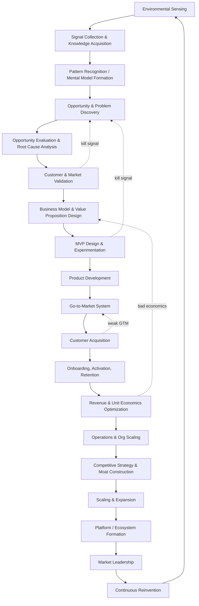
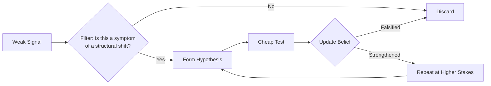
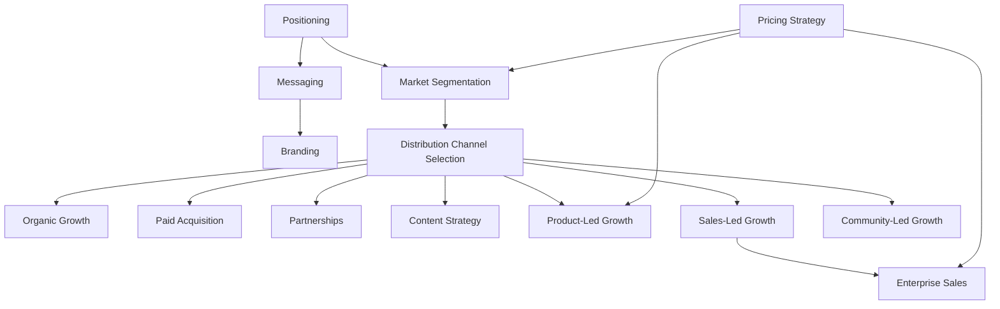
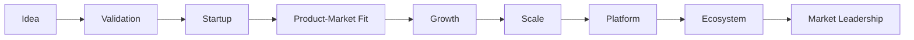
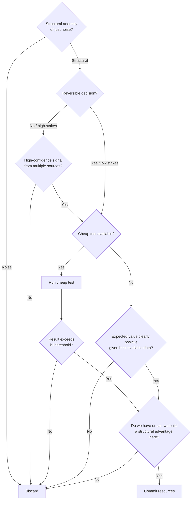

# The Entrepreneurial Operating System (EOS): A First-Principles Reconstruction

## 0. Framing & Assumptions

Entrepreneurship is modeled here not as a linear pipeline but as a **nested set of coupled feedback loops** operating at three timescales:

- **Fast loops** (days–weeks): product experiments, sales calls, ad tests, hiring interviews
- **Medium loops** (months–quarters): GTM iteration, pricing changes, org design, capital deployment
- **Slow loops** (years): strategic positioning, moat construction, market category creation, reinvention

Elite founders (Bezos, Jobs, Musk, Collison, Huang, Hastings, Chesky, Gates) differ from average operators less in *which* stages they execute and more in **loop velocity, signal fidelity, and the discipline to kill loops that aren't compounding.**

**Assumptions stated explicitly:**
1. This model assumes access to capital markets, legal infrastructure, and a functioning economy — it is a private-sector, market-economy model.
2. "Elite" is operationalized as: repeated category creation or category domination across ≥1 venture, not single-hit survivorship.
3. Psychological constructs (e.g., "founder bias") are drawn from published cognitive/behavioral science, not diagnosis of any named individual.
4. Where public individuals are referenced, claims are drawn from widely reported strategic behavior, not quoted material.

---

## 1. The Master Loop (Top-Level Architecture)



The loop is **re-entrant at every node** — a mature company at node R still runs nodes A–D internally (this is what "staying paranoid" operationally means). Reinvention (S) is not a final stage; it's a permanent parallel process running underneath market leadership.

---

## 2. Internal Cognitive Loops

Elite entrepreneurs run a distinct decision-making architecture, drawn from decision theory, cognitive psychology, and Bayesian reasoning.

### 2.1 Signal-to-Idea Pipeline



- **Noticing opportunities**: elite founders over-index on *anomalies* — things that shouldn't be true given the current mental model but are (Bezos and internet traffic growth curves; Huang and the CUDA-general-compute mismatch; Hastings and DVD-by-mail vs. late fees). This is anomaly detection, a core mechanism in Kuhn's paradigm-shift theory and in Bayesian surprise literature.
- **Weak signals → ideas**: converted via *forced hypothesis generation* — stating a falsifiable claim ("if broadband penetration crosses X%, streaming becomes viable") rather than a vague hunch.
- **Uncertainty reduction**: sequential, cheap-to-expensive experiments (a real options approach, per McGrath's "Discovery-Driven Planning" and Real Options theory) — each test purchases information before committing capital.
- **Risk evaluation**: elite founders differentiate *Type I risk* (irreversible, e.g., certain regulatory or safety commitments) from *Type II risk* (reversible, e.g., most product decisions) — Bezos's "one-way vs. two-way doors" heuristic. Type II risk is taken quickly and cheaply; Type I risk gets slow, high-scrutiny deliberation.
- **What NOT to pursue**: governed by an explicit opportunity cost lens — every accepted project is implicitly rejecting all alternative uses of the same scarce founder attention and capital. The filter is usually: (a) does this compound instead of just adding, (b) is there a structural reason we win that a well-resourced competitor can't easily replicate, (c) is the market large enough in 5–10 years to matter.

### 2.2 Mental Model Evolution

Mental models are treated as **living, falsifiable artifacts**, not fixed beliefs — closer to scientific theories than opinions. The mechanism:

1. Model generates predictions.
2. Market/product/customer feedback contradicts or confirms.
3. Founder updates the model's parameters (fast) or its structure (rare, costly, high-value when it happens — analogous to a paradigm shift).

Failure mode: **model ossification** — founders who stop updating structure and only tune parameters, mistaking a broken model for a bad quarter.

---

## 3. External Business Loops

Each loop below is specified with inputs, outputs, feedback signal, core KPI(s), and dominant failure mode.

| Loop | Inputs | Outputs | Feedback Signal | Core KPIs | Failure Mode |
|---|---|---|---|---|---|
| **Product** | User behavior, support tickets, usage data | Feature changes, roadmap | Activation/retention deltas | Retention curve, NPS, feature adoption | Building for the loudest customer, not the representative one |
| **Marketing** | Positioning, market data | Awareness, demand | CAC, traffic quality, message resonance | CAC, brand recall, conversion rate | Message-market mismatch; scaling spend before message works |
| **Sales** | Qualified leads, product | Closed revenue, customer feedback | Win/loss reasons | Win rate, sales cycle length, ACV | Selling to non-ICP to hit quota |
| **Customer Success** | Onboarding data, usage | Retention, expansion | Churn reasons, health scores | NRR, churn rate, time-to-value | Success ≠ support; reactive-only CS |
| **Brand** | Product experience, comms | Trust, pricing power | Sentiment, unaided recall | Share of voice, price elasticity | Brand as decoration, not strategy |
| **Pricing** | Value delivered, WTP data | Revenue, positioning signal | Conversion by price point, expansion rate | ARPU, price realization, elasticity | Cost-plus pricing instead of value-based |
| **Referral** | Customer satisfaction, incentive design | New customer flow | Referral rate, K-factor | Viral coefficient, referral CAC | Incentivizing referral volume over referral quality |
| **Data** | All of the above | Decisions | Model accuracy vs. outcomes | Data latency, decision cycle time | Vanity metrics; dashboards no one acts on |
| **Financial** | Revenue, costs, capital | Runway, reinvestment capacity | Burn multiple, margin trend | Gross margin, burn multiple, runway | Growth at negative unit economics with no path to positive |
| **Hiring** | Org needs, culture | Capability, capacity | 90-day performance, regretted attrition | Time-to-fill, quality of hire, retention | Hiring for pedigree over role-fit; hiring ahead of proven need |
| **Culture** | Values-in-action, incentives | Behavior consistency at scale | Employee sentiment, decision speed | eNPS, decision latency | Values-as-poster (stated but not incentivized) |
| **Innovation** | R&D, market signals, internal ideas | New products/features/lines | Time-to-market, cannibalization rate | # experiments run, hit rate, time-to-signal | Innovation theater — activity without shipped bets |
| **Competitive Intelligence** | Market/competitor data | Strategic repositioning | Win/loss vs. named competitors | Relative share trend, feature parity gap | Reacting to competitors instead of running own strategy |

These loops are **coupled**, not independent — e.g., pricing loop output (ARPU) feeds the financial loop, which determines hiring loop budget, which determines product loop velocity. A systems-thinking view (Meadows' *Thinking in Systems*) treats the company as a set of stocks (cash, talent, trust, data) and flows (revenue, hiring, churn) connected by these loops, with leverage points concentrated at loops that touch multiple stocks (pricing and hiring are unusually high-leverage).

---

## 4. Customer Journey (Full Lifecycle)


| Stage | Founder Objective | Customer Psychology | Key Metric | Common Mistake | Optimization Lever |
|---|---|---|---|---|---|
| Awareness | Enter consideration set | Pattern-matching against known categories | Reach, unaided recall | Generic category messaging | Sharp category framing / naming a new category |
| Interest | Earn attention | Curiosity vs. skepticism | CTR, engagement rate | Feature-dumping | Lead with the pain, not the product |
| Consideration | Differentiate | Comparing against status quo & alternatives | Time-on-site, content depth | Competing on features competitors also have | Reframe the comparison axis |
| Evaluation | Reduce perceived risk | Loss aversion dominates gain-seeking | Trial starts, demo requests | Ignoring risk-reduction (guarantees, trials) | Make failure cheap and reversible |
| Purchase | Convert intent to commitment | Decision fatigue, need for certainty | Conversion rate | Friction in checkout/contracting | Remove steps, not add persuasion |
| Onboarding | Deliver first value fast | Anxiety about wasted decision | Time-to-first-value | Feature-tour instead of outcome-tour | Anchor onboarding to the customer's specific job-to-be-done |
| Activation | Cross the "aha" threshold | Forming initial habit loop | Activation rate | Defining activation as login, not value | Instrument the true "aha" moment via cohort analysis |
| Engagement | Build usage depth | Reinforcement learning (reward loop) | DAU/MAU, session depth | Engagement metrics that don't correlate with retention | Optimize for the behavior that predicts retention, not raw activity |
| Habit Formation | Make usage automatic | Cue-routine-reward loop (Hook Model, BJ Fogg's Behavior Model) | Habit strength / frequency | No external trigger cadence | Build reliable internal + external triggers |
| Retention | Prevent churn | Switching cost perception, sunk value | Retention curve, churn | Measuring retention only in aggregate, not cohort | Cohort-level retention curves, flattening point analysis |
| Loyalty | Deepen emotional/economic lock-in | Identity alignment with brand | Repeat purchase rate | Assuming satisfaction = loyalty | Build genuine switching costs (data, workflow, community) |
| Advocacy | Convert satisfaction to voice | Social proof-seeking, reciprocity | NPS, UGC volume | Asking for advocacy before value is proven | Ask at peak-value moments |
| Referral | Convert advocacy to acquisition | Trust transfer from peer to peer | Viral coefficient (K) | Generic referral programs | Incentive aligned with genuine value, not just cash |
| Expansion | Grow account value | Anchoring to current spend | Net revenue retention | Under-selling adjacent value | Usage-based expansion triggers |
| Repurchase | Sustain lifetime value | Habitual trust, low re-evaluation cost | LTV, repurchase rate | Treating repurchase as passive | Proactive lifecycle marketing tied to usage signals |

---

## 5. Go-to-Market System (as an Integrated System, Not Functions)



**System logic, not a checklist:**
- **Positioning** is upstream of everything — it determines which comparison set the customer uses, which determines which channels even make sense (enterprise positioning implies sales-led motion; self-serve positioning implies PLG/content).
- **Pricing** is not a finance decision — it's a positioning signal and a segmentation filter (high price filters for high-intent/high-budget buyers; usage pricing aligns vendor and customer incentives).
- **Channel choice follows buyer behavior, not founder preference**: low-complexity/low-price → PLG/content/organic; high-complexity/high-price → sales-led/enterprise; network-effect products → community-led.
- **Motions compound**: content feeds organic and informs sales collateral; community feeds referral and product feedback; PLG usage data feeds expansion motion for sales-led accounts (the "land via PLG, expand via sales" pattern used by Slack, Figma, Notion).

---

## 6. Company Growth System



| Stage | Primary Objective | Org Change | Decision-Making Change | Capital Allocation | Key Risk | Core Metric | Binding Constraint |
|---|---|---|---|---|---|---|---|
| Idea | Falsify or strengthen hypothesis | Founder(s) only | Founder intuition, fast | Near-zero, sweat equity | Solving a non-problem | # of validated learnings | Founder time |
| Validation | Prove willingness to pay | First 1–3 hires | Still founder-centric | Pre-seed/seed capital | False positive validation (friends/family bias) | Paying customers / LOIs | Signal quality |
| Startup | Build repeatable acquisition | Functional roles emerge | Founder + small team, high context-sharing | Seed/Series A | Premature scaling before PMF | CAC:LTV early signal | Cash runway |
| PMF | Reach retention/growth threshold | First managers | Data starts overriding intuition | Growth capital | Mistaking early traction for PMF | Retention curve flattening | Team bandwidth |
| Growth | Scale what works | Middle management layer | Process + data-driven | Series B/C, aggressive if unit economics hold | Scaling a broken funnel | Growth rate, CAC payback | Hiring velocity, systems |
| Scale | Institutionalize repeatability | Departments, specialized functions | Delegated, framework-driven | Efficient growth capital | Culture dilution, bureaucracy creep | Rule of 40, NRR | Org coordination cost |
| Platform | Enable others to build on you | Platform/ecosystem teams | Governance structures, APIs-as-product | Infrastructure investment | Platform without ecosystem demand | Third-party developer/partner activity | Trust from ecosystem partners |
| Ecosystem | Orchestrate a multi-sided network | Ecosystem management, BD at scale | Distributed decision rights | Strategic/M&A capital | Ecosystem fragmentation, partner conflict | Ecosystem GMV / network density | Governance credibility |
| Market Leadership | Defend and extend category | Full corporate structure | Board-level strategic governance | Diversified, defensive + offensive | Complacency, disruption from below | Category share, moat durability | Innovation velocity vs. incumbency drag |

---

## 7. Strategic Thinking

- **Anticipating future markets**: elite founders track *cost curves* (compute, storage, bandwidth, batteries, genomic sequencing) and bet on the point where a previously-uneconomic idea crosses viability — this is the mechanism behind AWS (compute elasticity), Tesla (battery cost curve), and streaming (bandwidth cost curve).
- **Timing advantage**: distinguished from "first mover" — the goal is to be *first when the enabling conditions are true*, not merely first to try. Being early to an idea before infrastructure exists is a common failure mode (many pre-broadband streaming attempts failed for this reason).
- **Competitive moats** (per Porter's Five Forces + modern network-effect theory):
  - Network effects (direct, indirect, data)
  - Switching costs (data lock-in, workflow embedding)
  - Economies of scale (cost structure advantages competitors can't match below a volume threshold)
  - Brand (trust as a risk-reduction asset)
  - Regulatory/IP protection
  - Counter-positioning (a superior model incumbents can't copy without destroying their existing business — Clayton Christensen's disruption framework)
- **Exploiting technological shifts**: elite founders treat platform shifts (mobile, cloud, AI) as *re-entry points* into markets that were previously locked by incumbent advantages — the shift resets the competitive landscape.
- **Capital allocation**: modeled on opportunity-cost discipline — every dollar is compared not just to "will this generate return" but to the best alternative internal use of that dollar (closer to a venture-capital mindset applied internally, per Michael Mauboussin's capital allocation research).
- **Exiting declining markets / reinventing before disruption**: requires an internal signal system independent of current revenue (which lags market reality) — usually built from customer behavior leading indicators, not financial lagging indicators.

---

## 8. Failure Mode Analysis

| Failure Mode | Root Cause | Detection Signal | Correction Mechanism |
|---|---|---|---|
| Solving the wrong problem | Skipped root-cause analysis; solved a symptom | Low engagement despite "positive" survey feedback | Return to root-cause (5-Whys / Jobs-to-be-Done interviews) |
| Building before validating | Founder conviction substituted for evidence | High build velocity, flat demand signal | Enforce a validation gate before build resourcing |
| Weak positioning | No clear "instead of X, use us because Y" | High CAC, long sales cycles, "feature comparison" objections | Rebuild positioning around the real alternative customers compare to |
| Poor pricing | Cost-plus instead of value-based pricing | High conversion at low price, but poor margin/expansion | Re-anchor price to quantified customer value |
| Distribution failure | Great product, no repeatable channel | High NPS, flat growth | Systematically test channels against ICP behavior, not founder preference |
| Lack of product-market fit | Premature scaling of an unproven loop | Retention curve never flattens | Stop scaling; return to cohort-level retention work |
| Organizational bottlenecks | Decision rights not delegated as company scales | Rising decision latency, founder as single point of failure | Push decision rights down with clear frameworks (not ad hoc delegation) |
| Founder bias | Overconfidence, confirmation bias, sunk cost | Ignoring disconfirming data, "just needs more time" pattern | Pre-committed kill criteria set *before* launch |
| Scaling prematurely | Confusing early demand spike with durable PMF | CAC rising faster than LTV as spend scales | Re-test unit economics at each order-of-magnitude of spend |
| Capital misallocation | No opportunity-cost discipline in budgeting | Multiple underperforming bets funded simultaneously | Rank all initiatives on a common expected-return basis quarterly |

---

## 9. Scientific Foundations

| Domain | Core Concepts Used Above | Key Sources |
|---|---|---|
| Economics | Opportunity cost, cost curves, market structure | Schumpeter (creative destruction), Christensen (disruption theory) |
| Strategy | Moats, positioning, counter-positioning | Porter (competitive strategy), Hamilton Helmer (*7 Powers*) |
| Systems Thinking | Stocks/flows, feedback loops, leverage points | Donella Meadows (*Thinking in Systems*) |
| Decision Theory | Reversible vs. irreversible decisions, real options | McGrath (Discovery-Driven Planning), real options literature |
| Game Theory | Competitive response modeling, signaling | Schelling (strategic behavior, focal points) |
| Behavioral Economics | Loss aversion, anchoring, sunk cost | Kahneman & Tversky (*Prospect Theory*) |
| Cognitive Psychology | Anomaly detection, mental model updating | Kuhn (paradigm shifts), Bayesian belief updating literature |
| Organizational Theory | Decision-rights delegation, scaling structures | Chandler (*Strategy and Structure*) |
| Marketing Science | Positioning, category design, brand equity | Ries & Trout (positioning theory), Aaker (brand equity) |
| Innovation Research | Disruption, platform shifts | Christensen, Bower (*Disruptive Technologies*) |
| Operations Research | Throughput, bottleneck theory | Goldratt (*Theory of Constraints*) |
| Complexity Science | Emergence, adaptive systems, non-linear dynamics | Holland (complex adaptive systems), Beinhocker (*Origin of Wealth*) |

---

## 10. Integrated AI-Driven Entrepreneurial Research & Execution Operating System (Deliverable)

### 10.1 System State Machine

```mermaid
stateDiagram-v2
    [*] --> Sensing
    Sensing --> Hypothesis: anomaly detected
    Hypothesis --> CheapTest: hypothesis formed
    CheapTest --> Discard: falsified
    CheapTest --> Validation: strengthened
    Discard --> Sensing
    Validation --> BuildGate: economic viability confirmed
    Validation --> Discard: no viable economics
    BuildGate --> MVP: resourced
    MVP --> GTMTest: shipped
    GTMTest --> KillOrScale: signal collected
    KillOrScale --> Discard: below threshold
    KillOrScale --> Scale: above threshold
    Scale --> Operate: repeatable loop confirmed
    Operate --> Reinvent: leadership + market maturity
    Reinvent --> Sensing
```

### 10.2 Decision Tree — "Should We Pursue This Opportunity?"



### 10.3 Architecture for an AI-Driven Implementation

For an autonomous system (e.g., AI-EOS) to operationalize this loop, it needs discrete agents/modules mapped to the sections above:

| Module | Function | Maps to Section |
|---|---|---|
| **Sensing Agent** | Continuously ingests market/tech/data signals, flags anomalies vs. baseline model | §1–2 |
| **Hypothesis Engine** | Converts anomalies into falsifiable, testable claims with pre-committed kill criteria | §2, §10.2 |
| **Validation Agent** | Runs cheap tests (search demand, landing pages, outreach, synthetic customer interviews) and scores economic viability | §3–4 |
| **GTM Simulator** | Models channel fit against segment/pricing/positioning combinations before real spend | §5 |
| **Growth-Stage Classifier** | Continuously scores the venture against the Idea→Leadership stage model to flag premature scaling or under-investment | §6 |
| **Moat Analyzer** | Tracks competitive data to score durability of current advantage type | §7 |
| **Failure-Mode Monitor** | Pattern-matches operating metrics against the failure-mode table to raise early warnings | §8 |
| **Capital Allocator** | Ranks all active initiatives on common expected-return basis; enforces opportunity-cost discipline | §7, §9 |
| **Reinvention Trigger** | Runs the Sensing Agent internally even at market-leadership stage; forces periodic self-disruption reviews | §1, §10.1 |
| **Governance/Safety Layer** | Enforces kill criteria, prevents runaway capital deployment, requires human sign-off on Type-I (irreversible) decisions | Cross-cutting |

### 10.4 KPI Stack (Rolled Up by Subsystem)

- **Sensing**: signal-to-noise ratio, anomaly detection lead time
- **Validation**: cost per validated learning, false-positive rate
- **Product**: activation rate, retention curve slope
- **GTM**: CAC, CAC payback period, channel contribution mix
- **Financial**: gross margin, burn multiple, runway
- **Org**: decision latency, regretted attrition
- **Strategic**: relative market share trend, moat durability score
- **System-level**: overall loop-closure time (idea → validated learning → decision)

---

## 11. Explicit Limitations

1. This framework synthesizes widely reported patterns; it does not have privileged insight into any named founder's actual internal reasoning.
2. Real ventures rarely execute stages in the clean order shown — the diagrams represent the logical/causal structure, not a mandated sequence.
3. Category-creating businesses (which several referenced founders built) are the hardest case for this model, since defining "the market" happens concurrently with defining "the product" — the model treats this as an early, fast oscillation between §1–§6 rather than a single pass.
4. Applicability varies by capital environment, regulatory regime, and market maturity; the framework is most directly transferable to venture-backed, technology-enabled businesses, which was the implicit reference class throughout.
