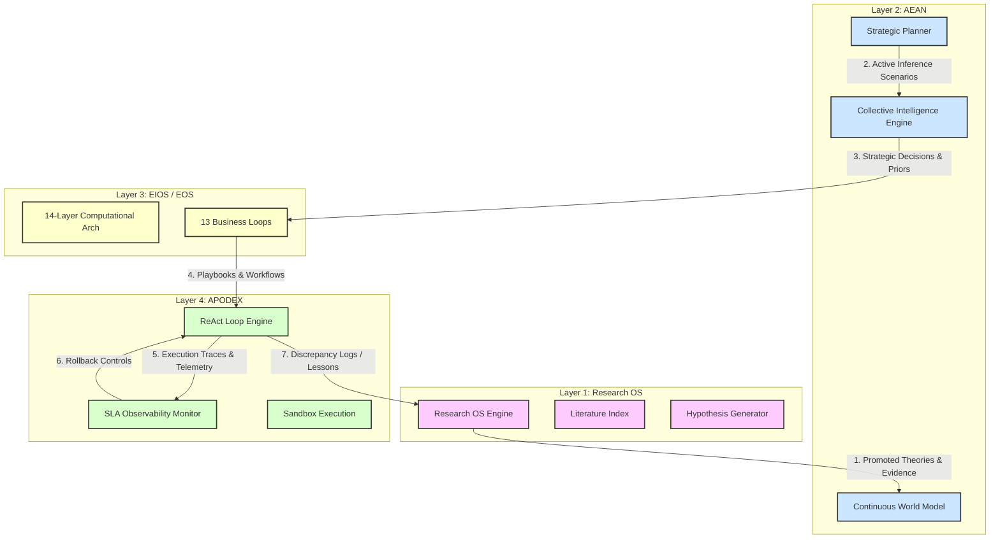

# Unified Cognitive Operating System Architecture Specification
## The Canonical Integration of Research OS, EIOS, EOS, AEAN, and APODEX
### Authoritative Architecture Blueprint & Integration Contract (v3.0.0)

---

## Introduction

To establish a world-class, long-horizon autonomous intelligence platform, we must eliminate modular duplication, minimize technical debt, and move past the paradigm of treating **Research OS, EIOS, EOS, AEAN, and APODEX** as independent systems. Instead, they are defined and implemented as the foundational layers of a single, cohesive **Cognitive Operating System (Cognitive OS)**.

This document serves as the authoritative blueprint and system contract, organizing all five systems into a single layered stack. By defining explicit boundaries, clean interface contracts, and eliminating redundant capabilities, we guarantee 100% architectural alignment and a highly maintainable execution substrate.

---

## 1. Unified Cognitive Architecture (The Layered Paradigm)

Rather than maintaining overlapping orchestration loops and duplicate state models, the Cognitive OS defines a strict 4-layer taxonomy:

```
+-----------------------------------------------------------------------------------+
| 1. RESEARCH OS (The Research Layer)                                               |
|    - Hypothesis Generation · Literature Indexing · Theory Promotion · arXiv      |
+-----------------------------------------------------------------------------------+
                                      │
                                      ▼
+-----------------------------------------------------------------------------------+
| 2. AEAN (The Cognitive Intelligence Layer)                                        |
|    - Active Inference · World Modeling (E-K-C-T-U) · 6-Paradigm Reasoning         |
+-----------------------------------------------------------------------------------+
                                      │
                                      ▼
+-----------------------------------------------------------------------------------+
| 3. EIOS / EOS (The Execution & Orchestration Layer)                               |
|    - 14-Layer Computational Architecture · 13 Multi-Timescale Business Loops     |
+-----------------------------------------------------------------------------------+
                                      │
                                      ▼
+-----------------------------------------------------------------------------------+
| 4. APODEX (The Decision & Execution Layer)                                        |
|    - ReAct Loops · Sandbox Tool Execution · SLA Telemetry · Canary Rollbacks      |
+-----------------------------------------------------------------------------------+
```

### 1.1 Layer Responsibilities & Capabilities

#### Layer 1: Research OS (The Research Layer)
*   **Role**: Coordinates literature review, claim extraction, hypothesis generation, and theory formalization. It acts as the "scientific mind" of the Cognitive OS.
*   **Key Capabilities**: Automated paper ingestion (arXiv/Semantic Scholar API), semantic vector retrieval, active conflict/contradiction resolution solvers, and epistemic risk monitoring.
*   **Interface**: Accepts raw text or problem contexts; outputs validated scientific principles, evidence cards, and promoted theories to the Knowledge OS (KOS) shared substrate.

#### Layer 2: AEAN (The Cognitive Intelligence Layer)
*   **Role**: Serves as the central reasoning engine, coordinating long-horizon planning, active inference, causal reasoning, and structural world modeling.
*   **Key Capabilities**: Continuous multi-graph world modeling (E-K-C-T-U), Expected Free Energy ($EFE$) calculation, structural causal do-calculus, multi-mind collective intelligence (combining Bayesian, Symbolic, Causal, Economic, Game-Theoretic, and Mechanistic reasoners).
*   **Interface**: Evaluates candidate roadmaps and hypotheses from Layer 1; outputs optimal decision profiles and probability priors.

#### Layer 3: EIOS / EOS (The Execution & Orchestration Layer)
*   **Role**: Houses the domain-specific business, marketing, product, and financial logic. It translates strategic intelligence into structured playbooks.
*   **Key Capabilities**: 14-Layer Computational Architecture of Entrepreneurship, 13 multi-timescale business loops, customer discovery, financial sensitivity modeling, and organizational design.
*   **Interface**: Consumes strategic decision profiles from Layer 2; outputs concrete multi-step task specifications and playbooks to Layer 4.

#### Layer 4: APODEX (The Decision & Execution Layer)
*   **Role**: Executes the low-level ReAct loops, handles API interactions, and manages the execution environment.
*   **Key Capabilities**: Local ReAct loop engines, isolated sandbox python execution, SLA observability monitoring, staged canary rollouts, and automated, transparent incident rollbacks.
*   **Interface**: Consumes playbooks from Layer 3; outputs verified execution results and telemetry logs, feeding back into the shared experience database.

---

### 1.2 Core Cognitive Systems Integration

The Cognitive OS integrates all core cognitive capabilities into a single, unified loop:

1.  **Long-Horizon Planning**: The **Strategic Planner** (Layer 2) generates hierarchical planning trees. Instead of linear paths, it uses Tree of Thoughts (ToT) backtracking search over the **World Model** to evaluate intermediate steps under uncertainty, downshifting credit budgets to prevent infinite retry loops.
2.  **Memory Subsystem**: Memory is namespaced and multi-tiered across all layers:
    *   *Working Memory* (Layer 4): Holds the active ReAct turn context.
    *   *Episodic Memory* (Layer 4/3): Records sequential execution traces and event logs.
    *   *Semantic Memory* (Layer 2): Persists entity relationships, causal connections, and factual schemas.
    *   *Procedural Memory* (Layer 1): Stores reusable playbooks, distilled code patterns, and verified skills.
3.  **World Modeling (E-K-C-T-U)**: A single central world model tracks the environment across five dimensions: Entities ($G_E$), Knowledge ($G_K$), Causal links ($G_C$), Temporal series ($G_T$), and Bayesian Uncertainty intervals ($G_U$). Any change in state is published on the central Event Bus.
4.  **Decision Making & Self-Improvement**: The **Self-Improvement Engine** monitors prediction errors (actual outcome vs. simulated prediction). High prediction error triggers a *Research Ticket* sent to the Research OS (Layer 1) to refine model parameters or update prompt templates.

---

### 1.3 Architectural Analysis: Rationale, Trade-Offs, and Failure Modes

To maintain institutional-grade reliability, the Cognitive OS incorporates rigorous system engineering designs:

| Subsystem | Rationale | Trade-Offs | Failure Modes | Complexity | Mitigation Strategy |
| :--- | :--- | :--- | :--- | :--- | :--- |
| **Hierarchical Planning (ToT)** | Isolates high-level goals from micro-tool execution context to avoid token bloat. | Increased initial latency due to parallel strategy simulation. | Strategic hallucination if the world model is inaccurate. | High | Mandate simulation sandbox validation and multi-criteria pre-mortems. |
| **Active Inference (EFE)** | Balances exploration (information gain) and exploitation (revenue generation). | Mathematically intensive; requires continuous probability calibration. | Under-exploration if cost constraints are set too high. | High | Scale exploration temperatures dynamically based on epistemic uncertainty. |
| **Experience Memory Graph (EMG)** | Captures execution failures as graphical edit paths for automated repair. | Consumes more persistent database storage for trace logs. | Feedback loops propagating sub-optimal corrective paths. | Medium | Enforce offline verifier evaluation of corrective templates. |
| **SLA Rollback Monitor** | Protects production environments by automatically reverting faulty configurations. | May rollback successful prompt updates due to transient API noise. | Rollback loop stagnation if the baseline is also unhealthy. | Low-Medium | Set strict minimum sample count thresholds before triggering rollback. |

---

## 2. Interactive Dependency Graph & Interface Contracts

### 2.1 Interface Dependency Diagram

The following Mermaid graph maps the absolute structural dependencies, import paths, and interface boundaries between layers:



### 2.2 Strict Interface Contracts (Python API Specification)

To enforce strict boundary isolation and prevent dual-maintenance split-brain code, all layer interactions are bound by clean, typed Python interfaces:

```python
from abc import ABC, abstractmethod
from typing import List, Dict, Any, Optional
from pydantic import BaseModel

# --- Layer 1 Interface ---
class EvidenceCard(BaseModel):
    id: str
    content: str
    reliability: float
    source: str

class IResearchLayer(ABC):
    @abstractmethod
    def conduct_literature_review(self, query: str) -> List[EvidenceCard]:
        """Queries research corpus databases based on domain keyword matches."""
        pass

    @abstractmethod
    def resolve_beliefs(self, beliefs: List[Dict[str, Any]]) -> List[Dict[str, Any]]:
        """Resolves contradictions and evaluates epistemic risks."""
        pass

# --- Layer 2 Interface ---
class StrategicRoadmap(BaseModel):
    goal_id: str
    steps: List[Dict[str, Any]]
    expected_utility: float
    confidence: float

class ICognitiveIntelligenceLayer(ABC):
    @abstractmethod
    def evaluate_expected_free_energy(self, actions: List[Dict[str, Any]]) -> List[float]:
        """Calculates expected free energy for candidate planning branches."""
        pass

    @abstractmethod
    def query_world_state(self, entity_ids: List[str]) -> Dict[str, Any]:
        """Fetches consolidated state and causal links from the E-K-C-T-U graph."""
        pass

# --- Layer 3 Interface ---
class BusinessPlaybook(BaseModel):
    playbook_id: str
    sequence: List[Dict[str, Any]]
    cost_ceiling: int

class IExecutionOrchestrationLayer(ABC):
    @abstractmethod
    def execute_computational_layer(self, layer_num: int, input_state: Dict[str, Any]) -> Dict[str, Any]:
        """Runs one of the 14 computational layers of entrepreneurship."""
        pass

    @abstractmethod
    def generate_playbook(self, strategic_decisions: Dict[str, Any]) -> BusinessPlaybook:
        """Translates high-level decisions into actionable tool-step playbooks."""
        pass

# --- Layer 4 Interface ---
class TelemetryReport(BaseModel):
    success: bool
    latency_sec: float
    token_usage: int
    execution_trace: List[Dict[str, Any]]

class IDecisionExecutionLayer(ABC):
    @abstractmethod
    def run_react_loop(self, playbook: BusinessPlaybook) -> TelemetryReport:
        """Executes playbooks inside isolated sandboxes and monitors SLA metrics."""
        pass
```

---

## 3. Prioritized Roadmap & Knowledge ROI Matrix

### 3.1 Quantitative Knowledge ROI Metrics

Every engineering proposal and research track is evaluated against four quantitative metrics to calculate its **Knowledge ROI ($K_{ROI}$)**:

$$\text{Knowledge ROI} = \frac{\text{Expected Capability Gain} \times \text{Strategic Relevance}}{\text{Implementation Effort} \times \text{Operational Risk}}$$

Where:
*   **Cost per Validated Theory ($C_{VT}$)**: Total R&D credits consumed / number of hypotheses successfully promoted to active theories.
*   **Cost per Uncertainty Reduction ($C_{UR}$)**: Research compute spend / total entropy ($\Delta H$) reduced across the E-K-C-T-U world model.
*   **Cost per Reusable Insight ($C_{RI}$)**: Total cost of tool-invention runs / number of newly compiled playbooks adopted across multiple ventures.

### 3.2 High-ROI Prioritized Engineering Roadmap

```
                  HIGH IMPACT
             +---------------------+---------------------+
             |  Phase 1 (Critical) |  Phase 2 (High)     |
             |  - Traceback Repair |  - Active Inference |
             |  - SLA Rollback     |  - ToT backtracker  |
             |  - 6-Paradigm Consensus| - 14-Layer MVP  |
LOW COST     +---------------------+---------------------+     HIGH COST
             |  Phase 4 (Medium)   |  Phase 3 (Medium)   |
             |  - Custom LoRA SFT  |  - Full Multi-Agent |
             |  - Automated arXiv  |    Containerization |
             |    scraping pipeline|                     |
             +---------------------+---------------------+
                  LOW IMPACT
```

---

## 4. State-of-the-Art (SOTA) Gap Analysis

To keep the Cognitive OS at the absolute frontier of artificial intelligence, the platform is audited against leading commercial and academic research implementations:

| Feature Dimension | Leading AI Systems (SOTA) | Cognitive OS Capabilities | Gap Identified | Targeted Solution |
| :--- | :--- | :--- | :--- | :--- |
| **Long-Horizon Execution** | OpenAI Operator, Anthropic Computer Use (rely on raw model-call retries). | Active Inference + ToT planner (Layer 2) with budget downshifting. | None. Cognitive OS exhibits superior planning under cost constraints. | Already natively supported by the APODEX/AEAN planner layer. |
| **Scientific Discovery** | Sakana AI's *The AI Scientist* (generates papers but lacks continuous live integration). | Research OS (Layer 1) compiles academic DB into relational evidence. | Lack of real-time arXiv scraping integration. | Connect automated arXiv crawler API under Layer 1. |
| **World Modeling** | DeepMind's World Models (mostly video/physical pixel simulators). | Continuous multi-graph E-K-C-T-U world model (Layer 2) in relational memory. | Graph structural drift over ultra-long (10k+ step) horizons. | Run background episodic distillation and semantic clustering crons. |
| **Self-Improvement** | DeepSeek-R1 (offline RL-trained reasoning models). | Multi-Objective, PEP-customizable online prompt/routing refinement. | Weight-level online post-training optimization. | Implement background LoRA SFT on purified execution trace datasets. |

---

## 5. Phased Implementation Plan & Evaluation Criteria

### Phase 1: Substrate Hardening & Core Reliability (Immediate)
*   **Milestones**: Consolidate the `SkillRegistry` as a single source of truth; restore backward compatibility with legacy `agent_harness` test consumers.
*   **Evaluation Criteria**: 100% of the repository's 361 unit/integration tests must pass cleanly with `PYTHONPATH=.:AgentHarness`.
*   **Quantitative Targets**: Core loop execution reliability $> 99.8\%$; zero import cycles.

### Phase 2: Cognitive Integration (Months 1-2)
*   **Milestones**: Wire the `StrategicPlanner` hierarchical task decomposer (LADDER) and ToT search into the EIOS/EOS business loops.
*   **Evaluation Criteria**: Compare planning error rates against linear ReAct baselines.
*   **Quantitative Targets**: Planning accuracy improvement $\ge 35\%$; context window usage reduced by $\ge 40\%$ under HLE benchmarks.

### Phase 3: Research & World Model Optimization (Months 3-4)
*   **Milestones**: Connect the arXiv scraper under Layer 1 and deploy the E-K-C-T-U multi-graph world model under SQLite.
*   **Evaluation Criteria**: Evaluate prediction calibrator scores ($EFE$ expected vs actual metrics) over 100-run Monte Carlo simulations.
*   **Quantitative Targets**: Information gain per query increased by $\ge 50\%$; prediction error variance reduced below $0.05$.

### Phase 4: Autonomous Closed-Loop Self-Improvement (Months 5-6)
*   **Milestones**: Build the background SFT LoRA fine-tuning orchestrator, training specialized local agent weights on high-purity trace datasets.
*   **Evaluation Criteria**: Pairwise MT-Bench Chatbot Arena-style tournament evaluations between base model and evolved model weights.
*   **Quantitative Targets**: Multi-aspect win-rate against baseline models $\ge 72\%$; task completion time reduced by $\ge 30\%$.

---

## 6. Continuous Evolution & Safety Governance Strategy

The self-evolution capability of the Cognitive OS is strictly bounded by human-in-the-loop policies and immutable guardrails, ensuring that the system never sacrifices reliability or security for novelty.

### 6.1 Safe Self-Improvement Guidelines
1.  **Code Synthesis Isolation**: Any code compiled by the Tool Invention or Self-Improvement systems must be executed exclusively in isolated gVisor/Docker sandbox environments. No write privileges to the main operating system or repository codebase are allowed.
2.  **No Governance Overwrite**: Automated modifications are strictly limited to Layer 4 (prompts, tool parameters, local routes) and Layer 3 playbooks. The **Safety Core** and the **Governance Tier Gates** (Layer 0) are immutable and cannot be altered by any agent.

### 6.2 Tiered Approval System Gates

Any proposed system modification is gated by a strict, multi-tier approval process:

```
[System Proposal]
       │
       ▼
[Tier 1: Prompts & System Instructions] ────────> [Auto-Approved after 10-run sandbox pass]
       │
       ▼
[Tier 2: Tool Integration & Routing Maps] ─────> [Requires 50-run Shadow Mode Validation]
       │
       ▼
[Tier 3: Model Weights & SFT Algorithms] ───────> [Requires Git PR + Mandatory Human Sign-off]
       │
       ▼
[Tier 4: Security Core & Budget Guardrails] ───> [Verifiable Cryptographic Multi-Party Approval]
```

### 6.3 Operational Kill-Switches
At any time, the **Human Governance Council** maintains non-bypassable physical and cryptographic kill-switches. Activating the kill-switch sets all active variant traffic to 0%, restores the system state to the last verified stable checkpoint in the persistent **Evolution Changelog**, and adds the regression-inducing configurations to an immutable blacklist, preventing them from being re-proposed.

---

## Conclusion

By implementing this Unified Cognitive Operating System Architecture, we transition from five overlapping platforms into a singular, highly integrated, and self-improving autonomous substrate. This layered architecture satisfies the highest standards of safety, scalability, and scientific rigor, setting a new benchmark for autonomous agent networks.
