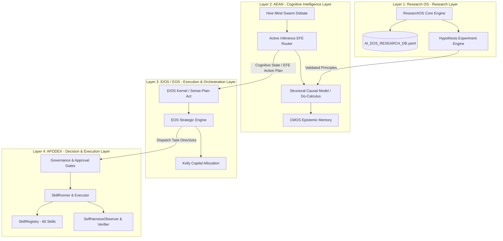

# Unified Dependency Graph & Inter-Layer Contracts

**Document Version:** 1.0.0
**Status:** Authoritative Architectural Standard
**Subsystems Covered:** Research OS, AEAN, EIOS, EOS, APODEX

---

## 1. Architectural Principles & Unidirectional Flow

The Unified Cognitive Architecture enforces **Strict Downward Unidirectional Dependency Flow**. Higher layers may call into or dispatch events to lower layers, while lower layers publish status, execution metrics, and events back to higher layers strictly via asynchronous observer callbacks or returned response objects.

```
       Layer 1: Research OS (Research Layer)
                          │
                          │ Hypothesis / Principles
                          ▼
    Layer 2: AEAN (Cognitive Intelligence Layer)
                          │
                          │ Beliefs / Causal Graph / Active Inference Directives
                          ▼
Layer 3: EIOS / EOS (Execution & Orchestration Layer)
                          │
                          │ Executable Workflows / Capital Allocation Plans
                          ▼
       Layer 4: APODEX (Decision & Execution Layer)
```

### Dependency Invariants
1. **Layer 4 (APODEX)** MUST NOT import or depend on Layer 1, 2, or 3.
2. **Layer 3 (EIOS/EOS)** MUST NOT import Layer 1 or Layer 2 modules directly; it interacts via standard contract schemas.
3. **Layer 2 (AEAN)** consumes validated hypotheses from Layer 1 via `ResearchOS` export routines.
4. Circular dependencies across layers are strictly forbidden and enforced via AST static analysis.

---

## 2. Mermaid Dependency Graph



---

## 3. Inter-Layer API Contract Schemas

### 3.1 Research OS -> AEAN Contract (`ResearchPrincipleExport`)
```json
{
  "type": "object",
  "properties": {
    "principle_id": {"type": "string", "example": "P-ACT-INF-132"},
    "source_paper_id": {"type": "integer", "example": 132},
    "title": {"type": "string", "example": "Expected Free Energy Active Inference"},
    "target_subsystem": {"type": "string", "enum": ["AEAN", "EOS", "EIOS", "ResearchOS"]},
    "formal_definition": {"type": "string"},
    "p_value": {"type": "number", "maximum": 0.05},
    "effect_size_cohens_d": {"type": "number"}
  },
  "required": ["principle_id", "source_paper_id", "target_subsystem", "p_value"]
}
```

### 3.2 AEAN -> EIOS/EOS Contract (`ActiveInferenceDirective`)
```json
{
  "type": "object",
  "properties": {
    "directive_id": {"type": "string"},
    "timestamp": {"type": "string", "format": "date-time"},
    "pragmatic_value": {"type": "number"},
    "epistemic_value": {"type": "number"},
    "efe_score": {"type": "number"},
    "causal_confidence": {"type": "number", "minimum": 0.0, "maximum": 1.0},
    "recommended_action": {"type": "string"}
  },
  "required": ["directive_id", "efe_score", "recommended_action"]
}
```

### 3.3 EIOS/EOS -> APODEX Contract (`TaskDirectiveSpec`)
```json
{
  "type": "object",
  "properties": {
    "task_id": {"type": "string"},
    "skill_name": {"type": "string"},
    "parameters": {"type": "object"},
    "max_cost_tier": {"type": "string", "enum": ["FREE", "LOW", "MEDIUM", "HIGH"]},
    "required_governance_level": {"type": "string", "enum": ["NONE", "AUTOMATED", "TIER2_APPROVAL", "HUMAN_SIGN_OFF"]}
  },
  "required": ["task_id", "skill_name", "parameters"]
}
```

---

## 4. Module Ownership Matrix

| Module Path | Primary Class / Component | Unified Layer | Description |
|---|---|---|---|
| `apodex/ai_eos/research/research_os.py` | `ResearchOS` | Layer 1 | Scientific discovery & power analysis |
| `apodex/research_os/statistical_validation.py` | `StatisticalValidation` | Layer 1 | Welch's t-test & Holm-Bonferroni |
| `apodex/world_model/world_model.py` | `WorldModel` | Layer 2 | Causal graph & Bayesian beliefs |
| `apodex/arcs/kernel/kernel.py` | `EIOSKernel` | Layer 2/3 | Active inference & SCM interventions |
| `apodex/aean/coordination/hive_mind.py` | `HiveMindSwarm` | Layer 2 | Multi-agent debate & Nash clearing |
| `apodex/memory/cmos/` | `CMOSEngine` | Layer 2 | Epistemic memory with Ebbinghaus decay |
| `apodex/ai_eos/intelligence/eos_first_principles.py` | `EOSFirstPrinciplesEngine` | Layer 3 | 13 business loops & Kelly sizing |
| `apodex/skills/registry.py` | `SkillRegistry` | Layer 4 | 60 operational skills population |
| `apodex/skills/runner.py` | `SkillRunner` | Layer 4 | Execution runtime & circuit breaker |
| `apodex/harness/feature_tests.py` | `SelfHarnessObserver` | Layer 4 | Turn-by-turn LLM/tool observation |
| `apodex/governance/approval.py` | `ApprovalGate` | Layer 4 | Governance policy enforcement |
