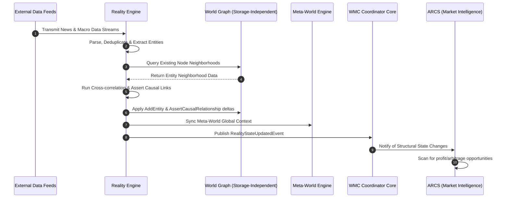
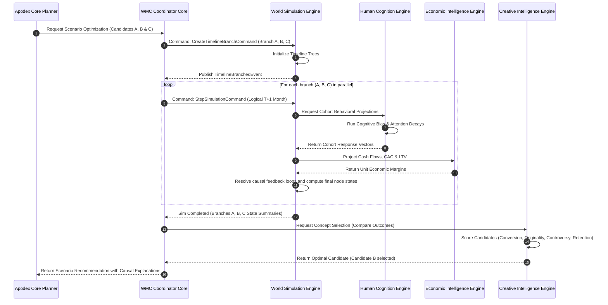
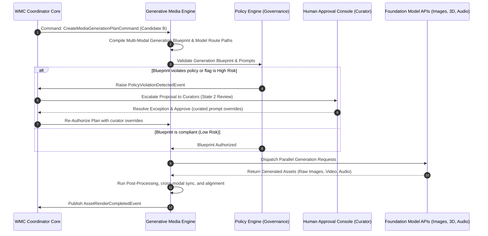

# World Model Creator (WMC) Sequence Flows & State Machines
## Architectural Workflows and Lifecycle Transitions

---

## 1. High-Level Scenario Workflows

This document outlines the step-by-step interactions between the ten core engines, the Apodex Cognitive OS, and the Human Governance Layer.

### 1.1 Trend Ingestion & Causal Mapping (Reality Ingestion)
The following sequence shows how the WMC ingests real-world data, updates the World Graph, and notifies downstream applications of market opportunities:



---

### 1.2 Multi-Option Scenario Simulation & Optimization
The following workflow details how the Apodex Planner requests simulation of multiple candidate strategies (such as testing different pricing levels) to optimize decisions before executing them:



---

### 1.3 Supervised Media Generation & Governance Workflow
This sequence illustrates how media generation is planned, audited against strict safety policies, escalated to human curators if needed, and finalized:



---

## 2. Core State Machines & Lifecycles

The WMC maintains internal state machine transitions for timelines, hypotheses, and rendering workflows.

### 2.1 Timeline Lifecycle
Timelines represent versioned states of a simulated or real world. A timeline can transit through the following states:

```
        +---------------+
        |    Draft      |  <-- Initialized state
        +-------+-------+
                |
                | (Compile & Apply Deltas)
                v
        +---------------+
        |   Executing   |  <-- Simulation calculations active
        +-------+-------+
                |
                +-----------------------------------------+
                | (Sim step finishes)                     | (Causal failure)
                v                                         v
        +---------------+                         +---------------+
        |   Committed   |                         |    Failed     |
        |  (ReadOnly)   |                         +---------------+
        +-------+-------+
                |
                | (Merge to main / Prune)
                v
        +---------------+
        |   Archived    |  <-- Read-only archive state
        +---------------+
```

### 2.2 Hypothesis Evaluation State Machine
Hypotheses represent unproven beliefs tested inside the simulation loop:

```
                  +-----------------+
                  |   Formulated    |  <-- Initial state
                  +--------+--------+
                           |
                           | (Injected into branch)
                           v
                  +-----------------+
                  |    Testing      |  <-- Active in simulation
                  +--------+--------+
                           |
            +--------------+--------------+
            | (P(B|E) >= 0.8)             | (P(B|E) < 0.2)
            v                             v
   +-----------------+           +-----------------+
   |    Validated    |           |    Refuted      |
   | (Merge to main  |           | (Pruned /       |
   |  world beliefs) |           |  Archived)      |
   +-----------------+           +-----------------+
```
