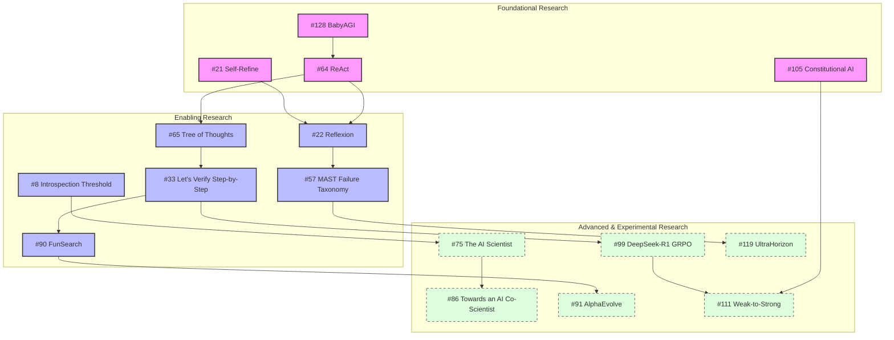

# AI-EOS Research Dependency Graph

This document constructs the engineering prerequisite and dependency graph for the AI-EOS research corpus. Rather than organizing papers by publication date or section order, we structure them by technical dependencies: which papers act as the foundational building blocks, which enable subsequent advanced layers, and which represent optional/experimental extensions.

---

## 1. Topological Research Dependency Graph (Mermaid)

The following Mermaid diagram outlines the core architectural dependencies. Foundational papers support the creation of the enabling papers, which in turn support the experimental/optional branches.

---

## 2. Dependency Hierarchy Classification

### 2.1 Foundational Research
These papers represent the irreducible minimum architecture of AI-EOS. Without implementing these, no autonomous execution can begin.
- **#128 BabyAGI & #129 AutoGPT:** Establishes the core recursive task queue management and self-directed goal decomposition loops.
- **#64 ReAct:** The fundamental paradigm interleaving reasoning and action steps, grounding execution in environment feedback.
- **#21 Self-Refine:** Directs immediate, SFT-free single-agent self-correction and multi-turn iterative editing.
- **#105 Constitutional AI & #106 InstructGPT:** Establishes non-bypassable structural alignment rules, guiding how systems critique and align their outputs against explicit policies.

### 2.2 Enabling Research
Enabling research bridges raw task execution and robust production capability, introducing automated error recovery, step-wise verification, and structured self-improvement.
- **#22 Reflexion:** Introduces persistent episodic verbal error recovery (storing reflective summaries inside an memory graph).
- **#57 MAST Failure Taxonomy:** Categorizes why multi-agent systems fail, directly informing the guardrail design in the AI-EOS verification layers.
- **#33 Let's Verify Step-by-Step (PRM800K):** Moves beyond final-answer outcome supervision, introducing high-granularity step-by-step process reward modeling.
- **#90 FunSearch & #92 ELM:** Establishes evolutionary program database searching (LLMs as mutations with deterministic test evaluations) to optimize capabilities.
- **#8 Introspection Threshold:** Establishes the mathematical limits of self-reference, proving the need for a multi-mind consensus mechanism to avoid semantic degradation.

### 2.3 Optional & Experimental Research
These papers represent high-leverage but complex or resource-heavy directions. They should remain experimental or shadow-tested before promotion.
- **#75 The AI Scientist & #86 Towards an AI Co-Scientist:** Closed-loop scientific discovery engines that formulate hypotheses, run experiments, and generate research papers. Highly autonomous but costly and resource-heavy.
- **#99 DeepSeek-R1 & #100 GRPO:** Reinforcement learning via verifiable rewards without learned reward models. Extremely effective but requires heavy pre-training and massive hardware resources to compile.
- **#111 Weak-to-Strong Generalization:** Investigates whether weak supervisors can align and evaluate strong models. Crucial for long-term safety, but not an immediate requirement for current enterprise workflows.
- **#119 UltraHorizon & #121 SWE-Marathon:** Bleeding-edge long-horizon benchmarking and execution paradigms that address memory decay and context locking.

---

## 3. Prerequisite Mapping for Core Subsystems

| Target AI-EOS Component | Direct Research Prerequisites | Enabling Research Prerequisites | Dependency Rationale |
|---|---|---|---|
| **Experience Memory Graph (EMG) Engine** | `#21 Self-Refine` | `#22 Reflexion`, `#57 MAST Failure Taxonomy` | To build action decision graphs that map failure modes, we must first collect verbal reflection histories (`#22`) and taxonomize failures (`#57`) before generating sequential edit paths. |
| **SEKISearchEngine** | `#90 FunSearch` | `#91 AlphaEvolve`, `#92 ELM`, `#97 MAP-Elites` | To execute evolutionary code block search, we require program databases (`#91`) and MAP-Elites-style diversity-preserving selection (`#97`) on top of the base FunSearch loop (`#90`). |
| **CollectiveIntelligenceEngine** | `#107 AI Safety via Debate` | `#11 Recursive RSA`, `#61 ECON Bayesian Nash` | Creating a multi-mind deliberation engine requires consensus aggregation (`#11`) and Nash equilibrium game-theory mapping (`#61`) built on top of the original debate layout (`#107`). |
| **RollbackManager** | `#3 self-correction-papers` | `#27 LLMs Cannot Self-Correct Reasoning`, `#28 Self-Verification Limits` | Automated state rollbacks must be guided by the empirical limits of self-verification (`#28`), recognizing when purely verbal correction fails (`#27`) and when to execute an actual database restore. |
